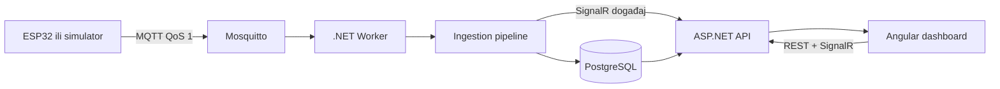
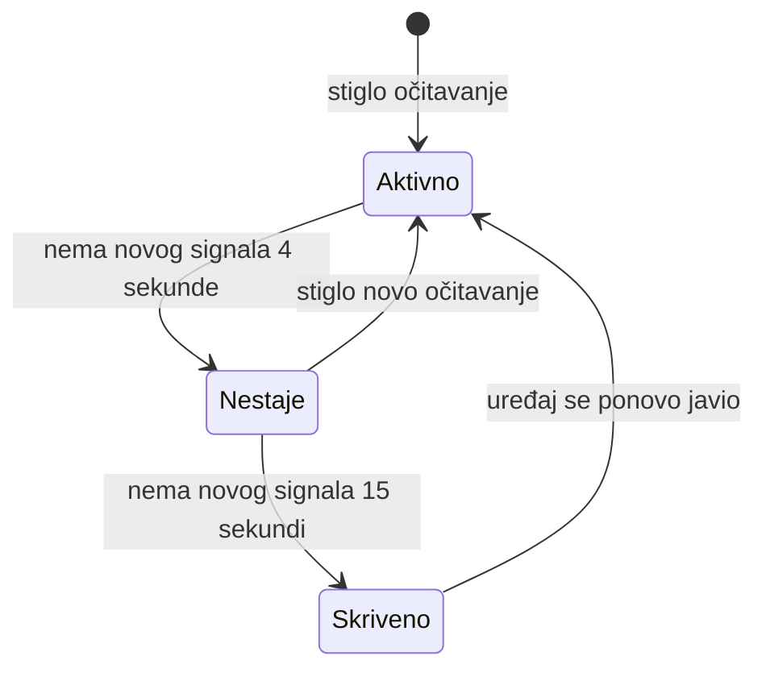

# Simulacija ESP32 senzora i tok rada sistema

Ovaj dokument objašnjava kako radi ceo sistem za detekciju uređaja, kako podaci
putuju od senzora do korisničkog interfejsa i kako se sistem demonstrira bez
fizičkih ESP32 senzora.

## 1. Pregled arhitekture

Sistem se sastoji od šest Docker servisa. Prvih pet čine aplikaciju, dok se
`simulator` pokreće samo kada želimo da generišemo testne podatke.

| Servis | Uloga | Pristup sa računara |
| --- | --- | --- |
| `postgres` | Čuva korisnike, sesije, uređaje, očitavanja, alarme i whitelistu | Samo unutar Docker mreže |
| `mqtt` | Mosquitto broker koji prima poruke senzora | `localhost:1883` |
| `worker` | Sluša MQTT, validira i obrađuje očitavanja | Nema javni port |
| `api` | REST API, autentikacija, SignalR i lokalizacija | `http://localhost:7108` |
| `frontend` | Angular aplikacija za profesora | `http://localhost:4200` |
| `simulator` | Glumi ESP32 senzore i objavljuje MQTT poruke | Pokreće se po potrebi |



Svi servisi u Compose-u dele internu Docker mrežu. Zato worker koristi adresu
`mqtt:1883`, a API bazu pronalazi preko hosta `postgres`. Nazivi servisa rade kao
DNS imena samo unutar te mreže.

## 2. Pokretanje i zaustavljanje

### Pokretanje aplikacije

Iz korena projekta:

```powershell
docker compose up --build -d
```

Provera statusa:

```powershell
docker compose ps
```

Nakon pokretanja dostupni su:

- aplikacija: <http://localhost:4200>
- mapa učionice: <http://localhost:4200/floor-map>
- Swagger: <http://localhost:7108/swagger>
- MQTT broker: `localhost:1883`

### Zaustavljanje bez brisanja podataka

```powershell
docker compose --profile tools down --remove-orphans
```

Ova komanda zaustavlja aplikaciju i simulator, ali čuva PostgreSQL i MQTT
volumene. Pri sledećem pokretanju korisnici, sesije i očitavanja ostaju u bazi.

### Potpuno resetovanje podataka

> Upozorenje: sledeća komanda trajno briše bazu ovog projekta.

```powershell
docker compose --profile tools down --volumes --remove-orphans
```

Koristi je samo kada je namerno potreban potpuno prazan sistem.

## 3. Autentikacija i baza

Razvojni korisnik se zadaje u korenom `.env` fajlu:

```dotenv
APP_USERNAME=admin
APP_PASSWORD=neka-lozinka
```

API pri prvom pokretanju kreira korisnika ako korisničko ime još ne postoji.
Lozinka se ne čuva kao običan tekst, već kao hash u tabeli `users`.

Promena `APP_PASSWORD` u `.env` fajlu ne menja automatski lozinku već postojećeg
korisnika. Bootstrap preskače kreiranje kada isto korisničko ime već postoji.

Podaci se čuvaju u Docker volumenu:

```text
device-detection---esp32_postgres-data
```

Direktan pristup bazi iz terminala:

```powershell
docker compose exec postgres psql -U postgres -d device_detection
```

Primer provere korisnika:

```sql
SELECT username, role FROM users;
```

PostgreSQL port nije objavljen na host računaru. Ako pgAdmin koristi neku bazu na
`localhost:5432`, vrlo verovatno prikazuje drugu lokalnu PostgreSQL instancu, a
ne bazu iz ovog Compose projekta.

## 4. MQTT ugovor

Worker sluša topic sa wildcardom:

```text
sensors/+/rssi
```

Svaki senzor objavljuje na sopstveni topic:

```text
sensors/{sensorId}/rssi
```

Primer poruke:

```json
{
  "eventId": "S1-1788700000000-a1b2c3",
  "deviceIdentifier": "AA:BB:CC:DD:EE:FF",
  "sensorId": "S1",
  "sessionId": "47e4a217-e562-463c-8329-638c09e58b97",
  "signalType": "wifi",
  "rssi": -62,
  "timestamp": "2026-09-06T17:00:00Z"
}
```

Značenje polja:

| Polje | Značenje |
| --- | --- |
| `eventId` | Jedinstveni identifikator događaja; služi za deduplikaciju QoS 1 poruka |
| `deviceIdentifier` | MAC ili drugi identifikator; hashira se pre čuvanja |
| `sensorId` | Senzor koji je video uređaj, na primer `S1` |
| `sessionId` | Ispitna sesija kojoj pripada očitavanje |
| `signalType` | `wifi`, `ble`, `bluetooth` ili `bluetooth_pairing` |
| `rssi` | Snaga signala od `-120` do `0` dBm |
| `timestamp` | UTC vreme kada je senzor napravio očitavanje |

Dozvoljeno je najviše pet minuta budućeg odstupanja sata senzora. Timestamp koji
je dalje u budućnosti odbija se kako ne bi pokvario vremenski prozor lokalizacije.

## 5. Obrada jedne poruke

Kada MQTT broker primi poruku, dešava se sledeće:

1. Worker je prima preko pretplate `sensors/+/rssi`.
2. JSON se pretvara u `WorkerIngressPayload` koristeći camelCase Web JSON pravila.
3. Ako `eventId` već postoji, poruka se ignoriše kao duplikat.
4. `deviceIdentifier` se hashira. Originalni identifikator se ne čuva u bazi.
5. Sistem pronalazi postojeći uređaj ili kreira novi.
6. Kreira se `device_observations` red sa senzorom, RSSI vrednošću i vremenom.
7. Proverava se da li je hash uređaja na whitelist-i izabrane sesije.
8. Izračunava se risk score.
9. Ako je score najmanje 70, kreira se alarm.
10. SignalR šalje `deviceUpdated` ili `alertCreated` događaj frontend aplikaciji.

Za isti uređaj i sesiju ne pravi se novi alarm ako je alarm već napravljen u
poslednja dva minuta. Time se sprečava zatrpavanje liste istim upozorenjem.

## 6. Risk score

Rezultat je broj od 0 do 100 i sastoji se od nekoliko delova:

- bliži signal povećava rezultat: `100 - apsolutna RSSI vrednost`
- potpuno nov uređaj dobija `+20`
- whitelistovan uređaj dobija `-30`
- Bluetooth pairing dobija `+30`
- BLE ili Bluetooth signal dobija dodatnih `+5`

Primer za novi uređaj sa `bluetooth_pairing` signalom i RSSI `-42`:

```text
proximity 58 + unknown 20 + pairing 30 + bluetooth 5 = 113
```

Vrednost se ograničava na 100, pa se dobija alarm sa score-om 100.

## 7. Lokalizacija uređaja

Učionica koristi tri senzora:

| Senzor | X | Y |
| --- | ---: | ---: |
| S1 | 0 | 0 |
| S2 | 8 | 0 |
| S3 | 4 | 6 |

Za svaki uređaj API uzima najnovije očitavanje svakog senzora iz
15-sekundnog prozora.

- Sa jednim ili dva senzora koristi se weighted centroid.
- Sa najmanje tri senzora RSSI se pretvara u procenjenu udaljenost i primenjuje
  weighted least squares lokalizacija.
- Dobijena pozicija prolazi kroz jednostavan Kalman smoother da marker ne bi
  naglo skakao zbog šuma u radio-signalu.
- API vraća `x`, `y`, confidence, broj senzora i vreme poslednjeg očitavanja.

Simulator računa RSSI iz poznate simulirane pozicije istim path-loss modelom i
dodaje mali deterministički šum. Zbog toga testira ceo algoritam, a ne samo
iscrtavanje unapred zadatih koordinata.

## 8. Živa mapa učionice

Angular stranica `/floor-map` poziva positions API svake dve sekunde.

Marker prolazi kroz sledeća stanja:



- `0–4 s`: uređaj je potpuno vidljiv i pulsira
- `4–15 s`: uređaj postepeno bledi
- posle `15 s`: marker se uklanja sa mape
- novo očitavanje istog uređaja odmah vraća marker

Mapa takođe prikazuje stolove, stolice, katedru, tablu, prozore, ulaz i stvarne
pozicije senzora. Pomeranje markera animirano je CSS tranzicijom.

## 9. Simulator

Simulator je Node.js servis definisan pod Compose profilom `tools`. Profil znači
da se simulator ne pokreće tokom običnog `docker compose up`, nego samo kada ga
eksplicitno pozovemo.

Simulator koristi iste promenljive `APP_USERNAME` i `APP_PASSWORD` iz `.env`
fajla. Kada nije prosleđen `--session`, on:

1. prijavljuje se na API;
2. kreira novu sesiju sa jedinstvenom prostorijom;
3. pokreće sesiju;
4. povezuje se na MQTT;
5. objavljuje izabrani scenario.

### Kompletan automatski test

```powershell
docker compose --profile tools run --rm --build simulator suite
```

`suite` pokreće normalan saobraćaj, whitelist, high-risk događaj, lokalizaciju i
edge-case poruke. Na kraju preko API-ja proverava:

- da su kreirana najmanje dva alarma;
- da postoji pozicija dobijena iz sva tri senzora;
- da postoji najmanje osam aktivnih uređaja.

Uspešan rezultat izgleda ovako:

```text
PASS alerts created: 2
PASS three-sensor position available
PASS active devices: 10
```

### Kontinuirani demo učionice

```powershell
docker compose --profile tools run --rm simulator demo --duration 300
```

Demo kreira osam whitelistovanih uređaja. Svaki uređaj je osam sekundi aktivan,
zatim ćuti deo ciklusa od 28 sekundi. Faze uređaja su pomerene, tako da se na
mapi stalno vidi kako se neke tačke pojavljuju, druge blede, nestaju i kasnije se
ponovo aktiviraju.

Opcije:

```text
--duration <sekunde>   ukupno trajanje, podrazumevano 180
--interval <sekunde>   razmak između slanja, podrazumevano 2
--session <guid>       koristi postojeću sesiju
```

Primer polučasovnog demo-a:

```powershell
docker compose --profile tools run --rm simulator demo --duration 1800
```

Za rad u pozadini:

```powershell
docker compose --profile tools run -d --rm simulator demo --duration 1800
```

Zaustavljanje pozadinskog demo-a zajedno sa aplikacijom:

```powershell
docker compose --profile tools down --remove-orphans
```

### Pojedinačni scenariji

#### Normalan saobraćaj

```powershell
docker compose --profile tools run --rm simulator normal
```

Šalje validne Wi-Fi i BLE poruke sa slabijim signalom koje ne treba da izazovu
alarm.

#### High-risk događaj

```powershell
docker compose --profile tools run --rm simulator high-risk
```

Šalje jak `bluetooth_pairing` signal nepoznatog uređaja koji treba da izazove
alarm.

#### Whitelist

```powershell
docker compose --profile tools run --rm simulator whitelist
```

Dodaje uređaj na whitelistu pre slanja jakog signala i proverava ponašanje
dozvoljenog uređaja.

#### Lokalizacija

```powershell
docker compose --profile tools run --rm simulator localization
```

Pomera jedan uređaj kroz pet poznatih tačaka i za svaku tačku šalje očitavanja
senzora S1, S2 i S3.

#### Edge case poruke

```powershell
docker compose --profile tools run --rm simulator edge-cases
```

Obuhvata:

- isti `eventId` poslat dva puta;
- RSSI granice `-120` i `0`;
- RSSI van opsega, na primer `-121` i `1`;
- nepoznat i prazan sensor ID;
- poruku bez opcionih polja;
- nevalidan JSON;
- nedostajuća obavezna polja;
- timestamp star 24 sata;
- timestamp 24 sata u budućnosti.

Greške za namerno nevalidne poruke očekuju se u worker logu:

```powershell
docker compose logs --tail 100 worker
```

#### Load test

```powershell
docker compose --profile tools run --rm simulator load --devices 100 --count 1000 --rate 50
```

Opcije:

| Opcija | Značenje | Podrazumevano |
| --- | --- | ---: |
| `--devices` | broj različitih uređaja | 100 |
| `--count` | ukupan broj MQTT poruka | broj uređaja × 5 |
| `--rate` | broj poruka u sekundi | 20 |

## 10. Korišćenje postojeće sesije

Svaki scenario može da dobije postojeći session GUID:

```powershell
docker compose --profile tools run --rm simulator localization --session 47e4a217-e562-463c-8329-638c09e58b97
```

Sesija mora postojati u bazi. Za najbolji prikaz treba da bude aktivna i izabrana
u padajućoj listi na mapi.

## 11. Pokretanje simulatora bez Dockera

Kada su MQTT i API već dostupni na host računaru:

```powershell
cd simulator
npm install
$env:MQTT_URL = "mqtt://localhost:1883"
$env:API_URL = "http://localhost:7108"
$env:APP_USERNAME = "admin"
$env:APP_PASSWORD = "lozinka-iz-env-fajla"
npm start -- demo --duration 300
```

## 12. Dijagnostika

### Pregled servisa

```powershell
docker compose ps
```

### Worker ne prima poruke

```powershell
docker compose logs --tail 100 mqtt worker
```

U uspešnom slučaju worker ispisuje da je povezan na `mqtt:1883` i pretplaćen na
`sensors/+/rssi`.

### Login ne prolazi

Proveriti `APP_USERNAME` i `APP_PASSWORD` u `.env`. Postojeći password hash se ne
menja samim uređivanjem `.env` fajla.

### Mapa je prazna

Proveriti sledeće:

1. izabrana je odgovarajuća sesija;
2. worker je aktivan;
3. simulator ispisuje da je povezan na MQTT;
4. scenario šalje podatke u isti `sessionId`;
5. očitavanja nisu starija od 15 sekundi.

### Pregled API health-a

```powershell
Invoke-RestMethod http://localhost:7108/health
Invoke-RestMethod http://localhost:7108/health/ready
```

Prvi endpoint proverava API proces, a drugi proverava i vezu sa PostgreSQL bazom.
