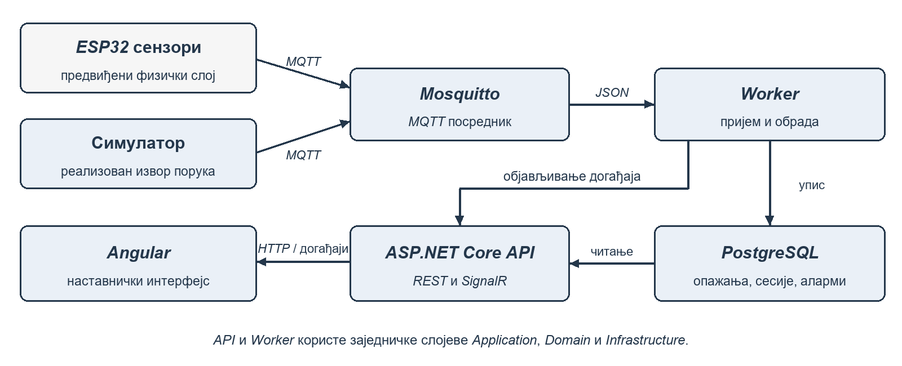
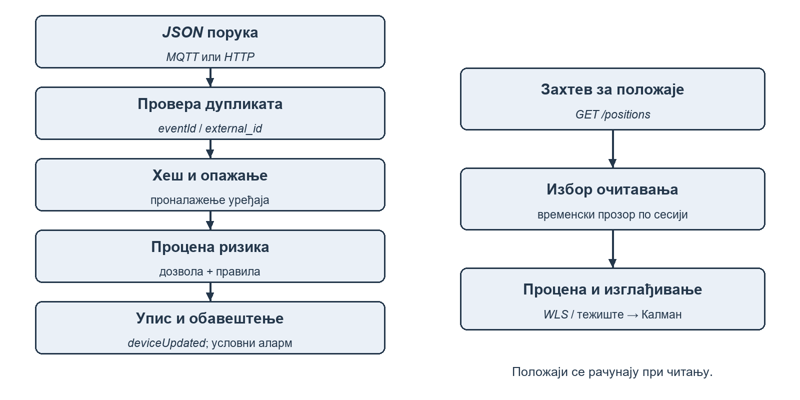
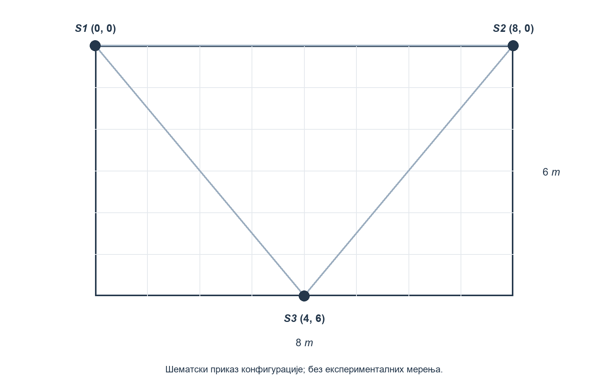
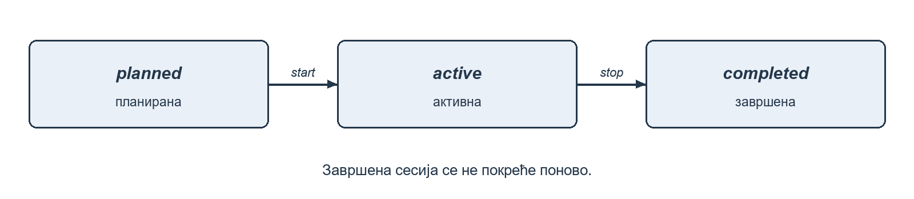

# Предговор

Овај рад представља технички опис система за детекцију бежичних уређаја и праћење њихове активности током испитних сесија. Систем је замишљен као подршка наставнику у уочавању појава које захтевају додатну проверу, уз обраду метаподатака о примљеном сигналу. Основу решења чине сензорски чворови засновани на платформи ESP32, MQTT комуникациони канал, серверска апликација развијена на платформи .NET и кориснички интерфејс реализован помоћу Angular оквира.

У доступној верзији пројекта реализовани су пријем и чување опажања, управљање испитним сесијама, израчунавање показатеља ризика, формирање упозорења и процена положаја уређаја. За локализацију су примењени модел слабљења сигнала, линеаризовани поступак пондерисаних најмањих квадрата и Калманово изглађивање координата. Кориснику су доступни контролна табла, мапа учионице, листа уређаја, преглед аларма, листа дозвољених уређаја и збирни извештаји.

Посебан део решења представља софтверски симулатор сензора. Он генерише поруке у истом формату који је предвиђен за ESP32 чворове, чиме омогућава испитивање серверске обраде и приказа без непосредног повезивања физичких уређаја. Изворни код фирмвера и резултати мерења у стварној учионици нису приложени у анализираном репозиторијуму. Због тога се у раду раздвајају реализоване софтверске функционалности, предвиђена хардверска поставка и поступци експерименталне провере које је потребно спровести.

Рад је организован тако да се најпре представе проблем и употребљене технологије, а затим архитектура, модел података и ток обраде. Посебна поглавља посвећена су локализацији, управљању сесијама, стабилности, безбедности, перформансама и тестирању. Завршни део разматра могућности даљег развоја и домет предложеног решења. Технички опис заснован је на стању доступног изворног кода прегледаног 10. септембра 2026. године [1].

# 1. Увод

Употреба мобилних телефона, паметних сатова и других бежичних уређаја поставља додатне захтеве пред организацију испита у физичком простору. Наставник има ограничен увид у активност уређаја који нису непосредно видљиви. Истовремено, само присуство радио-сигнала не говори довољно о разлогу његовог настанка: сигнал може потицати од дозвољене опреме, суседне просторије или уређаја који се аутоматски оглашава.

Предмет овог рада је развој софтверске основе за прикупљање и анализу таквих опажања. Уместо обраде садржаја комуникације, систем користи идентификатор извора, ознаку сензора, јачину примљеног сигнала, врсту сигнала и време детекције. Обрада је организована у оквиру испитне сесије, што омогућава повезивање догађаја са одређеним простором и временским интервалом.

Добијени резултат има саветодавни карактер. Упозорење означава да је скуп улазних података задовољио дефинисана правила, а не да је доказана недозвољена радња. Таква поставка одређује и начин приказа: наставнику се пружају подаци за проверу, док се одлука о њиховом значењу задржава у оквиру непосредног надзора испита.

## 1.1. Мотивација и циљеви

Основна мотивација је повезивање више извора мерења у јединствен информациони систем. Појединачно RSSI очитавање, односно показатељ јачине примљеног сигнала, има ограничену вредност. Када се повеже са временом, положајем сензора, претходним опажањима и списком дозвољене опреме, оно постаје погодније за тумачење.

Циљ имплементације је да обезбеди непрекидан ток података од извора мерења до наставничког интерфејса. Тај ток обухвата пријем порука, проверу основних ограничења, псеудонимизацију идентификатора, чување опажања и израчунавање показатеља ризика. Додатни циљ је приближно позиционирање уређаја на мапи учионице на основу очитавања више сензора.

Са становишта софтверског инжењерства, пројекат треба да покаже како се издвајају доменска правила, приступ бази и комуникациони механизми. Важан захтев је могућност развоја без сталне доступности хардвера. Због тога је симулатор део пројекта, а формат његових порука усклађен је са уговором за будуће сензорске чворове.

Основни циљеви и њихова реализација.

- Прикупљање опажања. Реализација: MQTT Worker и REST пријем. Начин провере: Симулиране поруке и преглед базе.

- Праћење испита. Реализација: Сесије planned, active и completed. Начин провере: Провера дозвољених прелаза.

- Уочавање ризичних догађаја. Реализација: Правила бодовања и праг 70. Начин провере: Познати улази и очекивани резултати.

- Приближна локализација. Реализација: WLS и изглађивање координата. Начин провере: Синтетички и будући теренски подаци.

- Приказ наставнику. Реализација: Angular странице и SignalR. Начин провере: Провера приказа и освежавања.

- Ограничено чување идентификатора. Реализација: SHA-256 са salt и pepper вредностима. Начин провере: Преглед начина уписа у базу.

## 1.2. Полазно стање и обим имплементације

Полазне спецификације предвиђају три ESP32 сензора, детекцију Wi-Fi и Bluetooth активности и процену локације уређаја. У њима се разматрају и сложенији обрасци, као што су међусобна близина уређаја и боравак ван очекиване зоне. При описивању реализације потребно је проверити који су од тих захтева заиста преточени у код.

Доступна имплементација садржи детерминистички сервис за процену ризика. Он користи јачину сигнала, информацију да ли је уређај нов у бази, припадност листи дозвољених уређаја и текстуалну ознаку врсте сигнала. У том сервису нису реализовани анализа путања, мерење растојања између парова уређаја нити модел машинског учења.

Такође, подршка за вредност bluetooth_pairing у поруци показује да сервер уме да обради тако означен догађај. Она сама по себи не потврђује да је физички сензор способан да поуздано препозна сваки покушај упаривања. За то је потребна посебна имплементација и експериментална провера на одабраном хардверу.

У наставку се као реализовано описује оно што је присутно у изворном коду. Планиране могућности разматрају се као унапређења. На тај начин документ представља проверљив опис пројекта и основу за његову наредну фазу.

## 1.3. Функционални захтеви и границе одговорности

Функционални захтеви описују радње које систем треба да омогући кориснику и поступке које обавља над примљеним подацима. У овом пројекту полазна јединица обраде је опажање. Његово прихватање не подразумева да је уређај већ поуздано смештен у просторију, нити да је утврђена његова намена. Зато су пријем, локализација и упозоравање раздвојени у посебне функционалности.

Први захтев односи се на евидентирање опажања из различитих сензора. За свако мерење потребно је знати извор, време и јачину сигнала. Други захтев је повезивање опажања са испитном сесијом. Трећи захтев је приказ резултата у облику који наставник може да прегледа током испита. Ови захтеви чине основни ток употребе и могу се проверити независно од тачности будућег физичког мерења.

Додатне функционалности обухватају дозволе за познату опрему, потврђивање аларма и збирни извештај. Њихова улога је да смање ручно претраживање података и организују резултате у контексту испита. На пример, потврда аларма бележи да је наставник обавештење прегледао. Она не означава да је сваки аларм оправдан, јер у моделу не постоји засебна евиденција исхода непосредне провере.

Границе одговорности система потребно је дефинисати и при његовом представљању. Систем не утврђује садржај порука, не идентификује особу само на основу RSSI вредности и не доноси аутоматску одлуку о прекршају. Он обједињује техничка опажања и примењује задата правила. Таква подела омогућава да се функционални успех, као што је исправно приказан аларм, разликује од тачности закључка о понашању конкретног корисника.

## 1.4. Учесници и типичан сценарио употребе

Главни корисник апликације је наставник који надгледа испит. Њему су потребни једноставан почетак сесије, увид у тренутно стање и могућност накнадног прегледа. Одржавалац система има другачију одговорност. Он припрема сервер, конфигурацију сензора и комуникационо окружење. Ове улоге представљају организациону поделу послова. У доступном коду није реализован посебан административни портал за све поступке одржавања.

Сензор је технички учесник који производи опажања. У софтверској демонстрацији исту улогу преузима симулатор. MQTT посредник преноси поруке, док Worker обавља њихов пријем. API омогућава приступ резултатима и управљање сесијом. Раздвајање тих учесника помаже да се при грешци утврди на којој граници је ток прекинут.

Типичан сценарио почиње пријавом наставника и избором просторије. После покретања сесије извори шаљу мерења са њеним идентификатором. Наставник прати контролну таблу и мапу, а затим прегледа евентуална упозорења. По завршетку испита зауставља сесију и преузима збирне податке. У овом сценарију је неопходно да извор порука користи идентификатор одговарајуће сесије. Само отварање мапе у прегледачу не мења садржај порука независног извора.

## 1.5. Метод израде и документовања

Опис пројекта заснива се на анализи изворног кода, конфигурације и расположивих тестова. Спецификације су коришћене за разумевање првобитних циљева, а код за утврђивање стварног понашања. Када се спецификација и имплементација разликују, у раду је описана конкретна разлика. Тај приступ омогућава да читалац разликује намеру пројектанта од тренутно реализованог поступка.

Рачунски примери у поглављу о алгоритмима изведени су из параметара наведених у коду. Они служе објашњењу формула и њихових последица. Ниједан такав пример не представља замену за мерење. Слично томе, предложени поступци тестирања описују шта треба проверити и које податке треба забележити. Њихово постојање у документу не значи да је експеримент већ изведен.

На означеним местима предвиђене су илустрације које аутор може накнадно да унесе. За снимке апликације треба користити сопствено покренуто окружење и демонстрационе податке. За фотографије хардвера потребно је приказати стварно употребљене плоче и распоред. Опис испод сваког места за слику указује шта слика треба да потврди. На тај начин илустрације постају део техничког објашњења, а не само визуелна допуна текста.

# 2. Преглед технологија

Технологије су изабране тако да раздвоје прикупљање мерења, пословну обраду и кориснички приказ. Сензорском делу потребан је једноставан формат порука, серверском делу поуздано чување и обрада, док клијентска апликација треба да омогући преглед података уз што мање ручног освежавања.

## 2.1. Клијентска страна

Клијентска апликација реализована је у Angular оквиру. У датотеци package.json наведене су зависности из гране 20.3, TypeScript из гране 5.9 и RxJS из гране 7.8. Ови подаци описују верзије декларисане у пројекту, а не препоруку за избор најновијег окружења [1].

Странице су организоване као самосталне компоненте које обједињују шаблон, стилове и понашање. Стање се у већем броју компоненти чува кроз signal, док computed служи за извођење зависних вредности. Angular сигнали прате промене вредности које компоненте користе при приказу [5]. У пројекту се тај механизам примењује, на пример, за број активних уређаја и број непотврђених аларма.

HTTP комуникација је издвојена у заједничке сервисе. Компонента иницира операцију, сервис формира захтев, а добијени резултат мења њено стање. Оваква организација спречава понављање путања и транспортне логике у свакој страници.

Руте за контролну таблу, мапу, уређаје, аларме, дозвољене уређаје и извештаје учитавају се преко loadComponent. Страница за пријаву доступна је посебно, док су остале странице смештене у заједнички распоред и заштићене клијентском провером пријаве. Серверска ауторизација остаје неопходна без обзира на ту проверу.

## 2.2. Серверска страна

Серверска апликација написана је у језику C# и циља .NET 9. ASP.NET Core API садржи контролере за пријаву, сесије, пријем опажања, уређаје, аларме, дозвољене уређаје и извештаје. Контролери позивају апликационе сервисе, док се приступ бази обавља преко инфраструктурног слоја [1].

Entity Framework Core повезује доменске моделе са PostgreSQL базом. Промене структуре воде се кроз миграције, које описују прелаз између верзија модела. Овај механизам омогућава постепено усклађивање базе са изменама апликације [7]. У пројекту су издвојене почетна миграција, додавање спољног идентификатора опажања, ревизионог записа и трајне аутентикације.

MQTT поруке прима засебан .NET процес Worker. Он користи MQTTnet библиотеку и позива исти апликациони интерфејс за пријем података који користи и API. Тиме се доменска обрада не везује искључиво за један транспортни протокол.

За обавештења је употребљен SignalR. Он омогућава серверу да шаље податке повезаним клијентима, уз подршку за различите транспортне механизме [6]. У овој апликацији служи за догађаје о уређајима и алармима, док мапа положаје преузима периодичним HTTP захтевима.

## 2.3. ESP32 и сензорски слој

Предвиђени хардвер заснива се на класичној ESP32 серији, за коју произвођач наводи Wi-Fi у опсегу 2,4 GHz и Bluetooth BR/EDR и BLE подршку [2]. При избору конкретне плоче потребно је проверити тачан модел: назив породице ESP32 сам по себи није довољна спецификација радио-могућности.

У предложеној поставци сензори имају познате координате и објављују опажања са својим идентификатором. За Wi-Fi је предвиђено пасивно ослушкивање, док BLE део треба заснивати на пријему огласних пакета. Bluetooth Classic inquiry није исто што и потпуно пасивно слушање, па се тај поступак не може без додатног објашњења подвести под пасивну детекцију целог система.

Wi-Fi и Bluetooth деле радио-ресурс, а документација описује временску поделу и ограничења коегзистенције [3]. Зато интервали скенирања из почетне спецификације представљају пројектни предлог. Њихова изводљивост и утицај на MQTT пренос морају се проверити у фирмверу и стварној поставци.

## 2.4. MQTT, PostgreSQL и Docker окружење

MQTT користи модел објављивања и претплате: извор шаље поруку на тему, а посредник је доставља заинтересованим претплатницима. Пројекат користи Mosquitto као посредник и теме облика sensors/{sensorId}/rssi. Worker се претплаћује на sensors/+/rssi. Ниво QoS 1 дозвољава поновљену испоруку, због чега је потребно препознавање већ обрађених догађаја [4].

PostgreSQL чува податке о сесијама, уређајима и опажањима. Docker Compose описује заједничко покретање базе, MQTT посредника, API-ја, Worker процеса и клијентске апликације. Симулатор је издвојен у профил tools, што омогућава његово покретање само када је потребан за демонстрацију или проверу.

Технолошки састав доступне верзије.

- Кориснички интерфејс. Технологија: Angular, TypeScript, SCSS. Улога: Приказ и управљање.

- HTTP сервер. Технологија: ASP.NET Core, .NET 9. Улога: REST операције и аутентикација.

- Позадински процес. Технологија: .NET Worker, MQTTnet. Улога: Претплата и пријем порука.

- Пословна логика. Технологија: C# сервиси. Улога: Сесије, ризик и локализација.

- Складиште. Технологија: PostgreSQL 16, EF Core. Улога: Трајно чување података.

- Обавештења. Технологија: SignalR. Улога: Догађаји ка клијентима.

- Посредник. Технологија: Eclipse Mosquitto 2. Улога: MQTT размена.

- Симулатор. Технологија: Node.js. Улога: Синтетичка сензорска опажања.

- Покретање. Технологија: Docker Compose. Улога: Повезивање компоненти.

## 2.5. Разлика између мерења, догађаја и приказа

У систему се појављује више облика исте информације. Сензорско опажање садржи измерену или симулирану RSSI вредност. Доменски запис је објекат који је прошао одређене провере и припремљен је за чување. Обавештење је порука намењена повезаним клијентима. Приказ на екрану је резултат тумачења једног или више таквих обавештења и одговора API-ја.

Ови облици немају исту трајност. Опажање може остати у бази и након што се веза са прегледачем прекине. Насупрот томе, пропуштено обавештење не мора бити аутоматски поново достављено. Прегледач може да покаже последње познато стање све док не добије нови одговор. Зато се у анализи система одвојено посматрају исправност података у бази и свежина корисничког приказа.

За развој је корисно да се један догађај прати од улазног идентификатора до одговарајућег записа. eventId има ту улогу у пријемном уговору. Идентификатор уређаја служи другој сврси, јер повезује више различитих догађаја. Мешање та два појма довело би до погрешног уклањања легитимних опажања или до прихватања поновљеног догађаја као новог мерења.

## 2.6. Избор комуникационих механизама

MQTT и HTTP користе се за различите облике интеракције. Извор мерења објављује поруке без потребе да познаје странице клијентске апликације. Корисник, с друге стране, задаје конкретне операције и очекује одговор. Раздвајање ових начина комуникације омогућава да промена интерфејса не захтева промену сваког извора мерења.

У пројекту HTTP пријем опажања има и практичну развојну улогу. Појединачна порука може се проследити директно API-ју ради провере доменског поступка, без MQTT посредника. То олакшава изоловање узрока грешке. Ако HTTP пут ради, а MQTT пут не ради, провера се усмерава на претплату, формат поруке или конфигурацију Worker процеса.

SignalR решава засебан проблем достављања обавештења прегледачу. Он не замењује базу нити служи као потпуна историја догађаја. REST операције зато остају потребне и када је веза за обавештења активна. Комбиновањем почетног преузимања стања и каснијих обавештења може се добити преглед који је и потпун и довољно свеж. Доступна реализација примењује делове тог обрасца, али не обезбеђује јединствен поступак опоравка сваке странице после прекида.

## 2.7. Временске ознаке и контекст мерења

Временска ознака одређује када је извор забележио опажање, док време серверске обраде означава када је порука прихваћена. Те вредности могу бити различите због преноса, чекања и одступања часовника. За тумачење кретања битно је време опажања. За мерење оптерећења сервера битно је и време пријема и завршетка обраде.

Уговор предвиђа UTC временску ознаку у ISO формату. Клијент може да прикаже време прилагођено локалном окружењу, али основа за поређење треба да остане доследна. При ручном испитивању не треба мешати локално време без наведеног помераја и време са ознаком UTC. Таква грешка може изгледати као проблем филтера старости иако је узрок погрешно означен улаз.

Временски прозор локализације захтева и упоредивост часовника различитих сензора. Ако један сензор систематски касни, његово очитавање може испасти из скупа или се повезати са другом фазом кретања. Зато синхронизација није само питање исправног приказа датума. Она утиче на то која мерења алгоритам сматра делом истог просторног стања.

# 3. Архитектура система

Архитектура система раздваја извор мерења од његове обраде и приказа. Исти формат опажања може потицати од симулатора или будућег физичког сензора. Серверски део затим примењује заједничка правила, а резултати се чувају у бази и стављају на располагање клијентима.

## 3.1. Преглед компоненти

Систем чине сензорски слој, MQTT посредник, Worker, апликациони сервиси, база података и API са клијентским интерфејсом. Слика 1 приказује границе тих компоненти. API и Worker су засебни извршни процеси, али деле доменску логику и инфраструктуру за приступ истој бази.



Ова организација ближа је слојевитој апликацији са издвојеним процесом за пријем него скупу независних микросервиса. Не постоје засебна складишта и независни доменски модели за сваку функционалност. Раздвајање процеса омогућава да MQTT пријем има сопствени животни циклус, док се правила обраде одржавају на једном месту.

API прихвата корисничке захтеве и објављује SignalR чвориште. Worker користи сопствени токен са улогом Worker да би преко тог чворишта проследио обавештења. Клијент тако не мора да зна који је процес првобитно обрадио догађај.

## 3.2. Слојевита организација серверске апликације

Domain садржи ентитете и основна правила њиховог настанка и промене. На пример, DeviceObservation проверава опсег RSSI вредности, а ExamSession ограничава прелазе између стања. Та правила не зависе од HTTP захтева или MQTT библиотеке.

Application дефинише случајеве употребе и интерфејсе према спољним зависностима. У њему се налазе сервиси за сесије, ризик, локализацију, листу дозвољених уређаја и извештаје. Интерфејси репозиторијума омогућавају да пословна логика приступа подацима без непосредног познавања начина њиховог чувања.

Infrastructure реализује те интерфејсе помоћу EF Core контекста и репозиторијума. У овом слоју је и LoggingRssiProcessingPipeline, који координира упис опажања, проверу листе дозвољених уређаја, позив сервиса за ризик и објављивање догађаја. Назив класе не треба тумачити као ограничење на логовање, јер она обавља главни ток пријема.

Api и Worker представљају улазне тачке. Они региструју зависности и повезују транспорт са апликационом логиком. Dependency injection омогућава да сервис добије одговарајући репозиторијум или објављивач догађаја без ручног конструисања целог стабла зависности.

Одговорности серверских слојева.

- Domain. Примери: Device, ExamSession, Alert. Одговорност: Доменски подаци и инваријанте.

- Application. Примери: RiskScoringService, PositionQueryService. Одговорност: Случајеви употребе и алгоритми.

- Infrastructure. Примери: AppDbContext, репозиторијуми. Одговорност: Чување и инфраструктурна обрада.

- Api. Примери: Контролери, MonitoringHub. Одговорност: HTTP и SignalR приступ.

- Worker. Примери: MqttWorker. Одговорност: MQTT пријем и позадински рад.

## 3.3. Трофазни процес обраде опажања

Прва фаза обухвата пријем и претварање JSON садржаја у улазни модел. Worker чита payload, преузима идентификатор уређаја и сензора, врсту сигнала и RSSI, а затим формира RssiIngressMessage. Ако временска ознака није прослеђена, користи се текуће серверско време.

Друга фаза обухвата трајну обраду. Најпре се проверава да ли eventId већ постоји. Затим се идентификатор уређаја хешира и тражи одговарајући запис. За нови уређај креира се ентитет, док се постојећем ажурира време последњег опажања. Ново опажање повезује се са уређајем и, ако је наведена, сесијом.

Трећа фаза обухвата процену ризика и обавештавање. Сервис проверава листу дозвољених уређаја и израчунава резултат. После чувања опажања објављује се deviceUpdated. Када је резултат најмање 70 и није пронађен недавни аларм за исти уређај и сесију, формира се Alert и шаље alertCreated.

Локализација је засебан пут читања. PositionQueryService рачуна положаје када клијент затражи /positions. Због тога се не може тврдити да је свако ново опажање већ у пријемном процесу претворено у положај и трајно сачувано. У тренутном моделу нема посебне табеле историје процењених координата.



## 3.4. Шема базе података

Централни објекти података су уређај и његова опажања. Запис у табели devices представља уређај под псеудонимизованим идентификатором, док device_observations садржи појединачна мерења. Тако се непроменљиви идентитет записа раздваја од великог броја временски означених очитавања.

Табела exam_sessions чува назив, просторију, време почетка и завршетка и статус сесије. Табела alerts садржи догађаје који су прешли праг ризика, а whitelist_entries дозвољене уређаје са интервалом важења. Помоћне табеле users, refresh_tokens и audit_logs подржавају приступ и евиденцију операција.

Основне табеле и одабрана поља.

- devices. Одабрана поља: Id, hash_id, type, first_seen_at, last_seen_at. Намена: Препознати идентификатори.

- device_observations. Одабрана поља: Id, device_id, sensor_id, session_id, rssi, captured_at, external_id. Намена: Појединачна опажања.

- exam_sessions. Одабрана поља: Id, name, room_id, starts_at, ends_at, status. Намена: Контекст испита.

- alerts. Одабрана поља: Id, device_id, session_id, risk_score, reason, acknowledged_at. Намена: Упозорења и потврде.

- whitelist_entries. Одабрана поља: Id, session_id, student_ref, device_hash, valid_from, valid_to. Намена: Дозволе у оквиру сесије.

- users. Одабрана поља: Id, username, password_hash, Role. Намена: Кориснички налози.

- refresh_tokens. Одабрана поља: Id, user_id, token_hash, expires_at, revoked_at. Намена: Обнова приступа.

- audit_logs. Одабрана поља: Id, actor, action, resource, status_code, created_at. Намена: Евиденција измена.

### 3.4.1. Односи међу подацима

Један уређај може имати више опажања и више аларма. Једној сесији логички припада више опажања, аларма и дозвола. Ови односи видљиви су кроз идентификаторе које сервиси користе у упитима.

У доступној EF конфигурацији нису експлицитно дефинисане релације преко HasOne и HasMany. SessionId се у више ентитета чува као текст, док је примарни идентификатор сесије Guid. Стога логичке везе описане у раду не треба изједначити са потпуно дефинисаним страним кључевима у бази. Увођење тих ограничења представља могуће побољшање интегритета података.

Конфигурација сензора налази се у подешавањима апликације, а распоред учионица у клијентском коду. Не постоји засебан трајни модел свих сензора и њихових положаја по просторији. Тај избор поједностављује прототип, али ограничава управљање већим бројем различитих простора.

### 3.4.2. Индекси и миграције

За hash_id уређаја и external_id опажања дефинисани су јединствени индекси. Они подржавају проналажење уређаја и контролу понављања догађаја. Додатни индекси постоје над временом опажања и комбинацијом сесије и времена, што одговара честим начинима претраге.

Индекси могу убрзати проналажење редова, али уносе трошак при изменама података [8]. Зато њихов ефекат у овом систему треба проценити на стварном обиму опажања. Само постојање индекса не гарантује да су упити који учитавају целу историју сесије довољно ефикасни.

Миграције се налазе у Infrastructure/Persistence/Migrations. API при покретању позива Database.Migrate, а затим иницијализује развојни налог. За локално окружење то поједностављује прво покретање. У контролисаном окружењу примену миграција треба уклопити у поступак испоруке и израде резервних копија.

## 3.5. Backend REST API

REST API организован је по ресурсима. Контролери за функционалности наставника захтевају улогу Professor. Пријава, обнова и опозив токена налазе се у AuthController, док су стање и спремност сервиса доступни кроз посебне health путање.

Одабране реализоване API операције.

- POST /api/auth/login. Намена: Пријава и издавање токена.

- POST /api/auth/refresh. Намена: Обнова приступа.

- GET /api/sessions. Намена: Преглед сесија.

- POST /api/sessions. Намена: Креирање планиране сесије.

- POST /api/sessions/start-for-room. Намена: Креирање и покретање за просторију.

- POST /api/sessions/{id}/start. Намена: Покретање постојеће сесије.

- POST /api/sessions/{id}/stop. Намена: Завршетак сесије.

- GET /api/sessions/{id}/positions. Намена: Процењени положаји.

- GET /api/sessions/{id}/alerts. Намена: Аларми сесије.

- POST /api/alerts/{id}/acknowledge. Намена: Потврда прегледа аларма.

- GET /api/devices/active. Намена: Уређаји у временском прозору.

- POST /api/ingestion/observation. Намена: Пријем једног опажања.

- POST /api/ingestion/batch. Намена: Пријем од 1 до 500 опажања.

- GET /api/reports/session/{sessionId}. Намена: Збирни извештај.

- POST /api/sessions/{id}/whitelist. Намена: Додавање дозволе.

- DELETE /api/sessions/{id}/whitelist/{entryId}. Намена: Уклањање дозволе.

Пријем преко HTTP-а враћа статус 202 након позива обраде. Избор тог статуса не значи да је у коду реализован трајни ред за накнадну обраду: контролер чека завршетак позваног сервиса. Пакетни захтев обрађује ставке редом и није представљен као једна атомична трансакција за све ставке.

Путања за активне уређаје користи временски прозор, подразумевано десет минута, без параметра сесије. Насупрот томе, положаји и аларми могу се захтевати за одређену сесију. Та разлика је важна када се тумаче бројеви у различитим деловима интерфејса.

## 3.6. Серверски модели и уговор поруке

RssiIngressMessage представља улаз у заједничку обраду. Одвојени Worker и HTTP модели преводе транспортне податке у овај запис. На тај начин се назив поља timestamp у MQTT поруци и CapturedAt у HTTP захтеву могу свести на исту семантику времена опажања.

Следећи пример приказује синтетичку MQTT поруку. Вредности су илустративне и не представљају забележено мерење:

```json
{
  "eventId": "S1-demo-0001",
  "deviceIdentifier": "02:00:00:00:00:01",
  "sensorId": "S1",
  "sessionId": "11111111-1111-1111-1111-111111111111",
  "signalType": "wifi",
  "rssi": -62,
  "timestamp": "2026-09-10T10:00:00Z"
}
```

eventId је предвиђен за препознавање поновљене испоруке. deviceIdentifier је улазни идентификатор који се пре трајног чувања претвара у хеш. sensorId одређује извор мерења, а sessionId контекст испита. signalType разликује wifi, ble, bluetooth и bluetooth_pairing у уговору поруке. rssi је број између −120 и 0 dBm.

DeviceObservation проверава да идентификатор уређаја није празан, да сензор има ознаку, да је RSSI у дозвољеном опсегу и да време није више од пет минута у будућности. Међутим, та класа не проверава да ли sensorId постоји у конфигурацији нити да ли sessionId означава активну сесију. То су разлике између документованог уговора и тренутног нивоа његове примене.

## 3.7. Frontend странице и компоненте

Кориснички интерфејс подељен је према задацима наставника. Контролна табла служи као почетни преглед, мапа приказује положаје, а странице уређаја и аларма омогућавају детаљнији увид. Посебне странице намењене су дозволама и извештајима. Заједнички MainLayout обезбеђује навигацију.

Мапа учионице користи координатни систем ширине осам и дубине шест јединица. Функције left и top претварају координате у процентуални положај HTML ознака. Положаји су визуелно ограничени тако да ознаке остану унутар приказа. То је својство интерфејса и не представља додатну физичку проверу локације.

Компонента мапе преузима положаје на сваке две секунде. Засебан часовник се ажурира сваке секунде и користи се за приказ старости података. Ознаке млађе од осам секунди сматрају се активним; затим им се смањује непрозирност, а после 45 секунди се више не приказују ако су и даље присутне у локалном скупу.

Сервер истовремено примењује свој прозор од 15 секунди у односу на најновије опажање сесије. Зато ознака може нестати раније ако наредни одговор сервера више не садржи тај уређај. Опис постепеног нестајања треба посматрати заједно са начином избора серверских података.

## 3.8. Клијентски сервиси

Api сервис дефинише типизоване операције и моделе одговора. AuthService управља пријавом и локално сачуваним токенима, док HTTP пресретач додаје приступни токен одговарајућим захтевима. Realtime сервис одржава SignalR везу и прима обавештења.

Realtime чува листе уређаја и аларма у сигналима. За deviceUpdated постојећи уређај ажурира се по хеш идентификатору, а нови се додаје у листу. Догађај alertAcknowledged мења време потврде одговарајућег аларма. Тако се приказ може променити без поновног учитавања целе странице.

Сервис предвиђа аутоматско поновно повезивање после прекида већ успостављене везе. Почетни неуспех повезивања поставља статус disconnected. Поновно успостављање везе не подразумева и поновну испоруку свих догађаја насталих током прекида, па је за потпуно усклађивање потребно поново преузети актуелно стање преко API-ја.

## 3.9. Позадински процес за пријем мерења

MqttWorker је изведен из BackgroundService. При успостављању везе претплаћује се на конфигурисану тему, а за сваку пристиглу поруку отвара опсег зависности и преузима IRssiIngestionService. Тиме појединачна обрада добија одговарајући животни век објеката за приступ бази.

Ако веза није успостављена, процес поново покушава повезивање. После неуспеха прави паузу од пет секунди. Изузеци при обради појединачне поруке бележе се у дневнику, што спречава да један неисправан JSON непосредно прекине целу петљу рада.

Не постоји посебан ред неисправних порука, нити трајни механизам поновног објављивања обавештења после уписа у базу. То значи да континуитет процеса и потпуност обраде нису исто својство. За јаче гаранције потребно је повезати чување пословног догађаја и његово накнадно слање.

## 3.10. Праћење једног опажања кроз систем

Ток обраде може се објаснити примером првог опажања непознатог Wi-Fi уређаја, са RSSI вредношћу −45 dBm. Претпоставља се да улаз има нов eventId, да је идентификатор сесије прослеђен и да за уређај не постоји важећа дозвола. Ове претпоставке су део рачунског сценарија и потребно их је навести да би се добијени резултат могао поновити.

Worker десеријализује поруку и позива апликациони сервис. Пријемни процес најпре проверава спољни идентификатор догађаја. Ако запис не постоји, хешира идентификатор уређаја. Репозиторијум затим не проналази одговарајући уређај, па се креира нови ентитет. Информација о томе да је уређај нов остаје доступна за текуће израчунавање ризика.

Основни допринос ризику износи 55, а допринос за нови уређај 20. Укупно се добија 75. Опажање се чува и објављује се ажурирање уређаја. Ако провера недавних аларма не пронађе запис у задатом интервалу, креира се нови аларм. Тиме су један улазни догађај и једно правило произвели два различита резултата за приказ: ажурирање уређаја и обавештење о ризику.

Ако затим стигне нова порука истог уређаја са другим eventId и истом јачином сигнала, уређај више није нов у бази. Резултат ризика постаје 55. Ако уместо тога стигне потпуно исти eventId, обрада се прекида пре поновног уписа. Пример показује зашто је при тестирању неопходно навести и претходно стање базе. Исти RSSI не мора увек произвести исти укупни резултат.

## 3.11. Идентификатори и раздвајање модела

Пројекат користи више врста идентификатора. Id доменског ентитета је интерни кључ записа. HashId представља псеудонимизовани идентификатор извора сигнала. ExternalId опажања потиче од eventId у поруци. SessionId повезује запис са испитом, а SensorId са местом са ког је мерење пристигло. Свака од тих вредности има различиту улогу у упитима и ограничењима.

На клијентској страни те разлике треба очувати у типизованим моделима. На пример, модел положаја садржи deviceId, координате, време опажања, број сензора и информацију о дозволи. Модел активног уређаја садржи и хеш и времена првог и последњег опажања. Ниједан модел сам по себи није потпуна копија свих података о уређају.

Разлика је видљива и у догађајима. Ажурирање уређаја шаље хеш идентификатор, док поједине REST операције користе интерни Guid. Ако клијент третира сва поља названа deviceId као исту врсту кључа, може погрешно повезати податке. За наредну верзију корисно је ускладити називе и јасно раздвојити интерни идентификатор од псеудонима приказаног кориснику.

## 3.12. Животни век података и зависности

Упис у базу и стање у меморији имају различите животне циклусе. Ентитет уређаја остаје доступан после поновног покретања API-ја, док стање Калмановог филтера не мора бити сачувано. Клијентске листе у прегледачу такође се формирају поново после учитавања странице. Зато поновно покретање може променити визуелни ток изглађивања иако трајна опажања нису изгубљена.

Пријемни процес користи опсег зависности за конкретну обраду. Објекти за приступ бази не треба да се деле произвољно између истовремених операција. Истовремено, сервис који чува стање положаја има потребу да препозна претходне процене. Та разлика показује зашто избор животног века сервиса представља део пројектовања, а не само синтаксу регистрације зависности.

Поред исправности, животни век утиче на коришћење меморије. Ако се стање неактивних уређаја никада не уклања, дуготрајан процес може чувати све више непотребних података. Могуће решење је евидентирање времена последњег ажурирања и периодично уклањање стања која више нису релевантна. То је предлог будуће допуне, а не својство потврђено у садашњој имплементацији.

# 4. Детекција, локализација и процена ризика

Алгоритамски део повезује три различита питања: да ли је опажање примљено, где се извор сигнала приближно налази и да ли улазни подаци задовољавају правила за упозорење. Ова питања користе заједничке податке, али дају резултате различитог значења и поузданости.

## 4.1. RSSI и модел удаљености

LocalizationService користи модел у коме се удаљеност процењује из разлике између референтног RSSI на једном метру и примљеног RSSI. У коду су фиксно постављени референтни ниво −45 dBm и експонент слабљења 2,7 [1]. Примењени израз је:

```text
d = 10 ^ ((A − RSSI) / (10 · n))
A = −45 dBm; n = 2,7
```

Величина d представља процењену удаљеност у метрима ако су координате и референтно мерење дефинисани у том систему јединица. За RSSI од −45 dBm израз даје један метар. За −72 dBm добија се десет метара. То су рачунски примери из задатих параметара, а не резултати теренског мерења.

Модел није директно мерење растојања. Иста јачина сигнала може настати у различитим условима, а фиксни параметри не описују све положаје и оријентације уређаја. Зато је пре процене практичне тачности неопходно прикупити контролна мерења у просторији у којој ће систем радити.

## 4.2. Распоред сензора и избор опажања

Подразумевана конфигурација поставља S1 у тачку (0, 0), S2 у (8, 0) и S3 у (4, 6). Такав распоред формира троугао, што обезбеђује неколинеарну геометрију за процену две координате. Слика 3 представља шему из конфигурације, без тврдње да су сензори физички постављени.



PositionQueryService најпре учитава опажања сесије. Од најновијег времена у том скупу одузима конфигурисани прозор, подразумевано 15 секунди. Затим задржава очитавања познатих сензора и за сваки уређај узима последње опажање по сензору.

Прозор није везан непосредно за текуће серверско време. Ако нових порука нема, последња група може и даље бити кандидат за процену, а клијент њену старост процењује засебно. Осим тога, очитавања различитих сензора у истом прозору не морају бити истовремена. Код покретног уређаја та разлика може утицати на доследност улазних удаљености.

## 4.3. Пондерисана процена положаја

Када су доступна најмање три очитавања, сервис претвара RSSI у удаљености и израчунава тежину сваког очитавања. Јачи сигнали добијају већу тежину према изразу w = 10 ^ ((RSSI + 100) / 20). Најјаче очитавање служи као референтно.

Одузимањем једначине референтне кружнице од осталих добија се линеаран систем по x и y. Код сабира коефицијенте нормалних једначина и решава систем димензије два. Ако је детерминанта сувише мала, примењује се резервни поступак пондерисаног тежишта.

```text
2(xᵢ − x₀)x + 2(yᵢ − y₀)y =
d₀² − dᵢ² − x₀² + xᵢ² − y₀² + yᵢ²

(Aᵀ W A) p = Aᵀ W b,  p = [x, y]ᵀ
```

Код тачно три сензора добијају се две независне линеарне једначине. У недегенерисаном случају њихово тачно решење не добија додатну робусност самим увођењем тежина; њихова улога је израженија када постоји више једначина него непознатих. Зато број сензора и распоред треба разматрати заједно са избором алгоритма.

Добијене координате ограничавају се на најмању и највећу координату конфигурисаних сензора по свакој оси. То је правоугаоно ограничење. Оно не доказује да је извор сигнала унутар учионице, нити представља проверу припадности троуглу сензора.

За мање од три очитавања користи се пондерисано тежиште положаја сензора. Тај резултат омогућава приближан приказ и када подаци нису потпуни. Међутим, један сензор не пружа јединствено решење положаја у равни, па такав приказ треба тумачити као резервну процену.

## 4.4. Показатељ поузданости и Калманово изглађивање

После процене положаја рачуна се просечна апсолутна разлика између геометријске удаљености до сензора и удаљености из RSSI модела. Показатељ confidence добија се као 1 / (1 + residual), ограничен на интервал од нуле до један. Код пондерисаног тежишта користи се поједностављена вредност зависна од броја очитавања.

Ова величина је хеуристички показатељ усклађености модела и улаза. Она није статистички калибрисана вероватноћа да се уређај налази у одређеној тачки. Висока вредност може постојати и када су улазне удаљености систематски погрешне.

KalmanPositionSmoother затим засебно изглађује координате x и y. За сваки уређај чува процену и грешку у меморији процеса. Процесни шум износи 0,01, мерни шум 2,0, а почетна грешка по координати 1 [1]. Један корак изглађивања дат је следећим изразима:

```text
P⁻ = P + Q
K = P⁻ / (P⁻ + R)
x̂ = x̂ + K · (z − x̂)
P = (1 − K) · P⁻
```

Овде је z нова координата, K појачање, а P процењена грешка. Исти поступак примењује се на другу координату. Ово је једноставан скаларни филтер по оси, без стања брзине и без временског корака у моделу кретања.

Изглађивање се позива при упиту за положаје. Зато поновљени упити могу поново обрадити исту групу мерења и утицати на стање филтера. Стање је везано за идентификатор уређаја, а не за пар који чине уређај и сесија. За строжу временску интерпретацију потребно је везати ажурирање за ново мерење и дефинисати ресетовање филтера.

## 4.5. Израчунавање показатеља ризика

RiskScoringService реализује правило бодовања чији је резултат цео број од 0 до 100. Основни допринос зависи од јачине сигнала. Нови уређај добија додатних 20 поена, дозвола смањује резултат за 30, ознака упаривања додаје 30, а Bluetooth или BLE ознака још пет.

```text
P = clamp(round(100 − |RSSI|), 0, 100)
R = clamp(P + U − W + B + T, 0, 100)
U = 20 за нови уређај; иначе 0
W = 30 за дозвољени уређај; иначе 0
B = 5 за Bluetooth/BLE; иначе 0
T = 30 ако signalType садржи „pair“; иначе 0
```

Израз „непознат уређај“ у овом коду значи да запис са датим хешом није постојао пре обраде поруке. То није исто што и уређај који нема дозволу у текућој сесији. Уређај откривен на претходном испиту може бити познат бази, а да нема дозволу на следећем испиту.

Рачунски примери резултата постојећег правила.

- RSSI: −80 dBm. Врста сигнала: wifi. Нов уређај: да. Дозвољен уређај: не. Резултат: 40. Праг 70: није достигнут.

- RSSI: −45 dBm. Врста сигнала: wifi. Нов уређај: да. Дозвољен уређај: не. Резултат: 75. Праг 70: достигнут.

- RSSI: −45 dBm. Врста сигнала: wifi. Нов уређај: не. Дозвољен уређај: не. Резултат: 55. Праг 70: није достигнут.

- RSSI: −45 dBm. Врста сигнала: wifi. Нов уређај: не. Дозвољен уређај: да. Резултат: 25. Праг 70: није достигнут.

- RSSI: −50 dBm. Врста сигнала: bluetooth_pairing. Нов уређај: не. Дозвољен уређај: не. Резултат: 85. Праг 70: достигнут.

- RSSI: −20 dBm. Врста сигнала: bluetooth_pairing. Нов уређај: не. Дозвољен уређај: да. Резултат: 85. Праг 70: достигнут.

Примери показују да дозвола умањује ризик, али не искључује аутоматски могућност аларма. Такође, након првог уписа истог уређаја нестаје допринос за нови уређај. Ове особине су последица садашње формуле и треба их имати у виду при подешавању правила.

Аларм се креира за резултат најмање 70, ако за исти уређај и сесију није пронађен аларм у претходна два минута. Та провера смањује понављање обавештења. Она није исто што и статистичка анализа аномалија, а истовремена обрада више порука захтева додатну контролу конкуренције ако се тражи строга забрана дуплирања аларма.

## 4.6. Рачунски пример локализације

Рад алгоритма може се проверити на унапред познатој тачки у моделу просторије. Нека се уређај налази у тачки (4, 3), а сензори у конфигурисаним тачкама (0, 0), (8, 0) и (4, 6). Геометријске удаљености тада износе пет, пет и три метра. У овом примеру најпре се од положаја израчунавају синтетичка очитавања, а затим се разматра обрнути поступак локализације.

За референтни ниво −45 dBm и експонент 2,7, модел даје RSSI приближно −63,872 dBm за прва два сензора и −57,882 dBm за трећи. Трећи сензор има најјачи сигнал, па у имплементацији постаје референтни. Уз идеалне, незаокружене вредности, систем једначина враћа почетну тачку. Заокруживање и додатни шум могу довести до одступања.

```text
S1 = (0, 0), S2 = (8, 0), S3 = (4, 6)
p = (4, 3)
d1 = 5 m, d2 = 5 m, d3 = 3 m
RSSI1 = RSSI2 ≈ −63,872 dBm
RSSI3 ≈ −57,882 dBm
```

Овај пример проверава унутрашњу доследност математичког поступка. Он не проверава да ли је изабрани модел добар опис стварне учионице. Када се синтетички подаци произведу истом формулом која се користи за обрнуто израчунавање, услови су повољнији него код физичког мерења. Због тога се такав пример користи као почетна провера алгоритма, док се оцена применљивости заснива на независно прикупљеним очитавањима.

## 4.7. Осетљивост модела на промену RSSI вредности

Однос RSSI вредности и удаљености у примењеном моделу је експоненцијалан. Зато једнака промена сигнала не значи једнаку апсолутну промену растојања на свим положајима. Из формуле следи да слабљење од 3 dB, уз експонент 2,7, множи процењену удаљеност фактором приближно 1,292. Ако је полазна процена два метра, нова је око 2,58 метара. Ако је полазна процена осам метара, нова је око 10,33 метра.

Наведене вредности су рачунски изведене и показују осетљивост формуле. Не описују измерену расподелу грешке. У пракси је зато корисно посматрати и промену процењеног положаја када се улаз намерно помери за малу вредност. Такав поступак може открити геометрију у којој је резултат нарочито осетљив на појединачни сензор.

Гранично ограничење координата додатно утиче на резултат. Ако рачун даје тачку ван конфигурисаног правоугаоника, координата се поставља на његову границу. То може визуелно изгледати као стабилан положај уз зид. Међутим, стабилност приказа тада потиче из ограничења алгоритма и не доказује да је уређај заиста на том месту.

## 4.8. Поступак калибрације параметара

Калибрација треба да почне јасно дефинисаном поставком. Сензор и извор сигнала постављају се на познату удаљеност, уз забележену оријентацију и режим рада. За сваку тачку прикупља се више очитавања. Појединачни узорак није довољна основа за подешавање јер би случајно одступање непосредно постало параметар модела.

Референтни ниво може се проценити на удаљености од једног метра, а експонент на више познатих удаљености. У односу RSSI и логаритма удаљености модел постаје линеаран по параметрима. То омогућава да се параметри процене из скупа узорака, а затим провере на другом скупу тачака. Раздвајање тачака за подешавање и проверу спречава да се квалитет модела оцењује само на подацима којима је прилагођен.

За пројекат је значајно и питање да ли сваки сензор треба да има сопствене параметре. Ако различите плоче систематски пријављују различите вредности у истој поставци, један заједнички референтни ниво може бити недовољан. Исто важи за различите типове сигнала. Доступна имплементација користи заједничке константе, па би увођење калибрације захтевало проширење конфигурације и начина избора параметара.

Запис о калибрацији треба да садржи датум, верзију фирмвера, ознаку плоче, просторију и поступак мерења. Ако се положај сензора касније промени, претходни резултат не треба аутоматски сматрати важећим. Поновљивост се обезбеђује описом услова под којима су параметри одређени.

## 4.9. Временска стабилност и објашњивост резултата

Изглађивање координата смањује нагле промене, али истовремено уводи заостајање за новим положајем. То је очекивана последица комбиновања претходне процене и новог мерења. При оцени филтера зато треба одвојено посматрати мировање и кретање. Поступак који даје миран приказ непокретног извора не мора најбоље пратити његово брзо премештање.

За проверу су погодна два синтетичка сценарија. У првом уређај мирује, а очитавања се мењају око задате вредности. У другом се положај нагло промени и затим остане сталан. Први сценарио показује колико се смањује расипање, а други колико корака је потребно да процена приђе новом положају. У оба случаја треба сачувати и изворну и изглађену путању.

Објашњивост је подједнако важна и код ризика. Корисник треба да разуме да ли је резултат повећан због новог уређаја, јаког сигнала или ознаке упаривања. Један број не приказује те разлике. Будући модел одговора могао би да садржи доприносе правила и верзију њихове конфигурације. Тако би и накнадни извештај могао да објасни како је резултат настао.

# 5. Управљање сесијама и додатне функционалности

Сесија повезује простор, време и резултате надзора. Њено издвајање омогућава да се опажања и дозволе посматрају у контексту одређеног испита, уместо као један неограничени ток активности.

## 5.1. Животни циклус испитне сесије

Нова сесија има статус planned. Покретањем прелази у active, а заустављањем у completed. Доменски модел не дозвољава поновно покретање завршене сесије. Апликациони сервис пре покретања проверава да ли у истој просторији већ постоји активна сесија.



Операција start-for-room обједињује креирање и покретање. То одговара току рада у коме наставник изабере учионицу и одмах започне очитавање. Промена стања се чува и објављује као sessionStateChanged.

Провера активне сесије тренутно је апликациона. Два истовремена захтева могу захтевати јачу заштиту на нивоу базе или трансакције. Слично томе, пријемна обрада сама не одбија свако опажање које се позива на завршену сесију. Управљање животним циклусом и валидацију долазних порука зато треба посматрати као повезане, али одвојене механизме.

## 5.2. Листа дозвољених уређаја

WhitelistEntry повезује сесију, референцу корисника или студента, хеш уређаја и временски интервал важења. Наставник може да дода уређај који је дозвољен у оквиру одређеног испита, као што је опрема потребна за организацију наставе.

При додавању се користи исти сервис хеширања као при пријему опажања. То је неопходно да би се исти улазни идентификатор препознао у оба поступка. Дозвола утиче на бодовање, а при преузимању положаја информација о дозвољености може бити укључена у одговор за мапу.

Референца student_ref служи организацији дозвола. Она не доказује да је уређај у тренутку сваког опажања код конкретне особе. Такво повезивање зависи од поступка регистрације и провере који се спроводи ван алгоритма за RSSI.

## 5.3. Аларми и потврда прегледа

Аларм садржи уређај, сесију, резултат ризика, разлог и време настанка. Поље acknowledged_at бележи да је аларм прегледан. Потврђивање не мења првобитни резултат нити брише запис, већ издваја обрађена обавештења од оних која тек треба проверити.

Тренутни разлог аларма је општа порука о прекорачењу прага. За практичнију употребу било би корисно приказати и појединачне доприносе резултату. Наставник би тако могао да разликује јак сигнал новог уређаја од догађаја означеног као Bluetooth упаривање.

## 5.4. Извештаји и CSV извоз

ReportingService формира збирни извештај са бројем опажања, бројем аларма, бројем различитих уређаја и временом генерисања. Клијентска страница преузима тај одговор за изабрану сесију и омогућава CSV извоз.

CSV се формира у прегледачу на основу тренутно приказаног извештаја. Доступна реализација не садржи сложен PDF извештај, графиконе трендова нити трајно архивирање путања кретања. Збирни бројеви одражавају податке који су у том тренутку присутни у бази.

Брисање старих опажања утиче на касније генерисање извештаја. После примене политике задржавања број опажања и различитих уређаја може се смањити, док аларми могу остати сачувани. Ако је потребан непроменљив завршни извештај, потребно је посебно сачувати његов снимак пре брисања детаљних података.

## 5.5. Припрема окружења за демонстрацију

Демонстрацију треба припремити тако да се јасно разликују техничко покретање и кориснички ток. Најпре се покрећу база, MQTT посредник, API, Worker и клијентска апликација. Затим се проверава да ли је API доступан и да ли су миграције примењене. Тек после тога има смисла покренути симулатор који креира сесију и шаље поруке.

За потребе приказа у раду пожељно је користити једну демонстрациону сесију са препознатљивим називом. Ако се сваки сценарио покреће са новом сесијом, снимци екрана могу случајно приказивати различите скупове података. У опису слике треба навести да ли се приказ односи на текући симулирани ток или на претходно сачуване резултате.

Место за наредну слику предвиђено је за преглед покренутих компоненти. На снимку треба да буду видљиви називи сервиса и њихово стање. Лозинке, токени и садржај приватних конфигурационих датотека не припадају тој илустрацији. Сврха слике је да повеже архитектурни опис са стварно покренутим софтверским окружењем.

{{SLIKA|okruzenje|Покренуте компоненте демонстрационог окружења.|Убацити снимак прегледа контејнера или терминала са стањем сервиса.}}

## 5.6. Пријава и почетни преглед

Поступак пријаве представља први корак корисничког тока. Наставник уноси корисничко име и лозинку, а клијент шаље захтев за издавање токена. Успешна пријава омогућава приступ заштићеним страницама. При провери треба обухватити и неисправан унос, јер приказ грешке мора кориснику да омогући исправку без нејасног стања апликације.

На снимку странице за пријаву довољно је приказати распоред поља и дугме за потврду. Није потребно приказивати стварну лозинку. Ако је циљ објашњење обраде грешке, може се направити засебан снимак са демонстрационом неуспешном пријавом. Тај снимак треба означити као пример понашања, а не као доказ неисправности сервера.

{{SLIKA|prijava|Страница за пријаву корисника.|Убацити снимак форме за пријаву без приказивања лозинке или токена.}}

После пријаве корисник приступа почетном прегледу. Контролна табла повезује информације о сесији и доступне функције. При тумачењу бројева треба проверити на који временски прозор и скуп података се односе. Број активних уређаја из општег упита не мора бити једнак броју различитих уређаја у извештају једне сесије.

Снимак контролне табле треба да садржи довољно контекста да читалац препозна изабрану сесију или просторију. Ако су приказани подаци настали симулацијом, то треба навести у коначном опису слике. На тај начин се избегава мешање демонстрационог интерфејса и резултата теренског испитивања.

{{SLIKA|kontrolna_tabla|Почетни преглед апликације током демонстрације.|Убацити снимак контролне табле са видљивим контекстом изабране сесије.}}

## 5.7. Избор учионице и покретање сесије

Избор просторије одређује контекст у коме наставник жели да прати податке. У доступној апликацији постоји операција која за просторију креира и одмах покреће сесију. Тај поступак је погодан за демонстрацију јер обједињује две радње. Ипак, његов резултат треба проверити у листи сесија, посебно ако је захтев прекинут или поновљен.

Током тестирања је корисно покушати и покретање друге активне сесије у истој просторији. Очекивано апликационо понашање је одбијање такве операције. Ова провера показује примену пословног правила. Она не замењује засебно испитивање два истовремена захтева, код којих је потребно проверити и конкуренцију.

{{SLIKA|izbor_sesije|Избор просторије и управљање активном сесијом.|Убацити снимак избора учионице и контрола за почетак или завршетак очитавања.}}

После покретања треба усагласити извор порука са добијеним идентификатором. Симулатор може сам припремити сесију, али тада наставнички интерфејс треба усмерити на исту сесију. Различити идентификатори могу довести до тога да се поруке успешно чувају, а изабрана мапа ипак остане празна. То није нужно проблем локализације, већ могући несклад контекста.

## 5.8. Тумачење мапе и листе уређаја

Мапа преводи координате у визуелни положај ознаке. Наставник преко ње добија приближан просторни преглед, али ознаку не треба везивати за конкретно седиште без потврђене тачности. Распоред клупа је визуелна помоћ. Он не повећава сам по себи просторну резолуцију мерења.

Приликом снимања мапе треба сачувати податак о томе колико сензора учествује у процени. Резултат добијен једним сензором има другачије значење од процене са три сензора. Такође треба погледати старост последњег опажања. Идентична координата на два снимка не мора значити да је уређај мировао ако између снимака није било нових података.

{{SLIKA|mapa|Мапа учионице са симулираним положајима уређаја.|Убацити снимак мапе током рада симулатора и у опису назначити да су подаци симулирани.}}

Листа уређаја допуњује просторни приказ временским и идентификационим подацима. У њој се може проверити да ли је уређај уопште присутан у резултату упита и када је последњи пут забележен. То је корисно када на мапи нема ознаке, јер непознат сензор или недостатак одговарајућих мерења може спречити локализацију иако запис уређаја постоји.

За илустрацију је потребно користити псеудонимизоване или демонстрационе идентификаторе. Довољно је приказати неколико редова који показују разлику између времена првог и последњег опажања. Снимак треба да остане читљив у коначној ширини документа, па приказ целог великог екрана са ситним текстом није погодан избор.

{{SLIKA|lista_uredjaja|Преглед детектованих уређаја и времена опажања.|Убацити читљив снимак листе са демонстрационим или псеудонимизованим идентификаторима.}}

## 5.9. Преглед аларма и дозвола

При појави аларма наставник најпре проверава сесију, време и уређај на који се запис односи. Потом упоређује информацију са непосредним стањем у просторији. Потврђивање аларма служи организацији рада. У доступном моделу не постоје посебна поља за опис стварно утврђене радње и доказни материјал.

За снимак екрана може се употребити сценарио high-risk из симулатора. У опису треба навести да је аларм изазван синтетичком поруком са задатим типом сигнала и RSSI вредношћу. Тиме се документује исправно повезивање правила и интерфејса, без тврдње да је физички сензор регистровао стварно упаривање.

{{SLIKA|alarmi|Преглед аларма насталог у контролисаном сценарију.|Убацити снимак аларма и његовог статуса пре или после потврде прегледа.}}

Дозволе је најбоље припремити пре слања мерења за изабрани уређај. Потребно је проверити сесију и временски интервал важења. Ако је дозвола унета за другу сесију или тек треба да почне да важи, она неће имати очекивани утицај на текући резултат.

Поређење сценарија са дозволом и без ње треба да користи исте услове, укључујући стање познатости уређаја. У супротном би промена резултата могла истовремено потицати од дозволе и од тога што је уређај већ уписан у базу. То је пример у коме пажљива припрема демонстрације олакшава објашњење пословног правила.

{{SLIKA|dozvole|Управљање листом дозвољених уређаја.|Убацити снимак листе или форме са сесијом и временским интервалом важења дозволе.}}

## 5.10. Завршетак испита и преузимање извештаја

Заустављање сесије бележи њен завршетак. Наставник затим може да преузме збирни извештај. За проверу је потребно упоредити бројеве у одговору API-ја и бројеве приказане на страници. Када се извози CSV, треба проверити и садржај преузете датотеке, а не само њено успешно појављивање у листи преузимања.

Број опажања описује количину сачуваних мерења, а број различитих уређаја број различитих интерних идентификатора у том скупу. То није нужно број физичких предмета у просторији. Промена идентификатора извора може утицати на број записа, док одсуство емисије може довести до тога да физички присутан уређај уопште не буде представљен у извештају.

{{SLIKA|izvestaj|Збирни извештај изабране испитне сесије.|Убацити снимак броја опажања, аларма и различитих уређаја, уз могућност CSV извоза.}}

После завршетка демонстрације треба забележити која је верзија апликације употребљена и који су сценарији покренути. Ако се снимци касније поново праве, потребно је проверити да ли политика задржавања није већ обрисала детаљна опажања. Коначни опис слике треба да одговара подацима који су стварно видљиви на снимку.

## 5.11. Улоге и регистрација личних уређаја

У систему су реализоване две корисничке улоге. Професор има увид у све испитне сесије, управља њиховим стањем, прегледа резултате и уређује ручну листу дозвољених уређаја. Асистент самостално креира и покреће своје сесије, прати њихове уређаје, потврђује аларме и прегледа извештаје. Ограничење се проверава на серверу, па познавање идентификатора туђе сесије не омогућава приступ њеним подацима.

Налог асистента креира професор кроз интерфејс апликације. Операција прихвата корисничко име и лозинку, а улогу поставља сервер. Асистент зато не може истом операцијом да додели себи професорска права. Лозинка се чува применом постојећег механизма хеширања лозинки. Корисничко име мора бити јединствено, а лозинка новог налога мора имати најмање дванаест знакова.

Пре првог праћења асистент региструје најмање један лични уређај. На страници „Моји уређаји” бира слободну учионицу и покреће кратко регистрационо скенирање док је сам у просторији. Та операција отвара посебну сесију чији је рок прикупљања два минута. Опажања се чувају ради избора уређаја, али се за њих не стварају аларми. Регистрационе сесије се не приказују у уобичајеној листи испитних сесија.

Откривање уређаја није исто што и утврђивање власништва. Сензор може примити сигнал опреме која није код асистента. Због тога систем не додаје аутоматски све пронађене идентификаторе. Асистент бира своје уређаје и сваком даје разумљив назив. За лакше препознавање може да региструје један уређај у појединачном скенирању. Овај поступак је заснован на корисничкој потврди, а не на доказу идентитета власника из радио-сигнала.

При потврди сервер проверава да је изабрани уређај заиста опажен у одговарајућој регистрационој сесији и у њеном временском интервалу. Клијент не шаље произвољан идентификатор који би се без провере ставио на листу. Потврђени хеш се повезује са корисником и регистрационом сесијом у моделу StaffDevice. Јединствено ограничење спречава повезивање истог хеша са два различита налога.

Успешна потврда завршава скенирање. Након истека двоминутног прикупљања корисник има још десет минута за избор већ пронађених уређаја. Истекло скенирање не прихвата нова опажања и не задржава просторију као заузету за наредно праћење. Ако корисник напусти страницу пре потврде, по повратку се приказује његово актуелно регистрационо скенирање док је рок за потврду отворен.

При сваком покретању редовне сесије систем учитава регистроване уређаје власника и додаје их на листу те сесије. Унос садржи везу са StaffDevice записом, што га разликује од ручне дозволе за студентски уређај. Лични уређај особља има ризик нула и не ствара аларм. За остале уређаје примењује се уобичајени модел бодовања. Ручно дозвољен уређај и лични уређај особља зато имају различито правило обраде.

Измена личних уређаја није дозвољена док корисник има активно редовно праћење. Он прво зауставља сесију, па затим мења регистрацију. Верзија евиденције личних уређаја користи се као токен оптимистичке конкуренције. Тако истовремено покретање и измена регистрације не могу неприметно да сачувају противречна стања истог корисника. Ова заштита не решава сва питања конкуренције између различитих корисника у истој просторији.

Регистрација важи за сачувани идентификатор. Ако уређај касније шаље други идентификатор, потребно је поновити поступак. Одвојени Wi-Fi и Bluetooth идентификатори могу бити регистровани као засебне ставке. Апликација не закључује аутоматски да два различита хеша припадају истом физичком уређају.

У доступном репозиторијуму не постоји фирмвер који прима команду за скенирање из прегледача. Зато дугме у апликацији отвара контекст за пријем опажања, а сензор или симулатор мора слати његов sessionId. Повезивање те операције са стварним сензорским чвором представља неопходан корак хардверске интеграције. Софтверска регистрација може се проверити симулатором, али та провера не представља физичко скенирање асистентовог телефона.

{{SLIKA|registracija_asistenta|Регистрација личних уређаја асистента.|Убацити снимак странице „Моји уређаји” са кандидатима и потврђеним уређајима. Користити демонстрациони налог.}}

# 6. Обрада грешака и стабилност система

Систем прима податке из више извора и зато мора да разликује неисправан улаз, недозвољену промену стања и инфраструктурни отказ. Јединствен начин приказивања грешака поједностављује клијентски код, али не замењује контролу поузданости целог тока.

## 6.1. Валидација улазних података

HTTP пријем користи атрибуте за обавезна поља, ограничење RSSI опсега и дозвољене вредности signalType. Пакетни пријем ограничава број елемената на 500. Доменски модел затим примењује основна правила независно од транспорта.

MQTT пут не пролази кроз HTTP атрибуте. Он се ослања на десеријализацију и доменске провере. Зато присуство правила у HTTP моделу не значи да су иста правила у потпуности примењена на MQTT поруку. На пример, непозната непразна ознака сензора може бити сачувана, али се касније не користи за позиционирање ако није у конфигурацији.

Време више од пет минута у будућности доменски се одбија, док само постојање старе временске ознаке није разлог за одбијање у приказаном коду. За потпуну контролу потребно је дефинисати старост дозвољених догађаја и понашање при накнадној испоруци.

## 6.2. HTTP грешке и дневници

ApiExceptionHandler преводи ArgumentException у HTTP 400, InvalidOperationException у 409, а остале изузетке у 500. За неочекивану грешку клијент добија општу поруку, док се детаљи бележе у серверском дневнику. Поједини контролери додатно враћају 404 када тражени ресурс није пронађен.

У пријемном процесу вредности које се уносе у дневник делимично се нормализују заменом знакова новог реда. За идентификатор уређаја користи се хеш. Овај избор смањује непотребно појављивање сирових идентификатора у редовним порукама о обради.

## 6.3. Поновљена испорука и прекиди комуникације

Провера external_id служи да поновљена порука са истим непразним идентификатором не створи ново опажање. Јединствени индекс представља додатно ограничење при упису. Ако eventId није наведен, овај поступак не обезбеђује препознавање дупликата.

Упис опажања, слање deviceUpdated и креирање аларма нису једна атомична операција. Ако објављивање догађаја не успе после првог чувања, опажање може остати у бази, док наредни корак са алармом није завршен. Поновљени eventId тада може зауставити поновну обраду на самом почетку. За поузданију испоруку потребан је трајни запис догађаја за накнадно слање, уз идемпотентну обраду.

Путања /health потврђује да API одговара, а /health/ready покушава повезивање са базом. Те провере не потврђују да сви ESP32 сензори шаљу мерења или да је MQTT ток потпун. Надзор целог система захтева и време последње поруке по сензору.

## 6.4. Разликовање отказа по компонентама

Недоступност једне компоненте може произвести различите видљиве последице. Ако MQTT посредник није доступан, Worker не успева да се претплати. Ако база није доступна, пријем поруке може успети на комуникационом нивоу, али не и њено трајно чување. Ако SignalR веза није доступна, подаци могу бити уписани без непосредног ажурирања прегледача.

Зато провера треба да прати исту поруку на више тачака. Најпре се утврђује да ли је извор објавио поруку. Потом се проверава пријем у Worker процесу, постојање опажања у бази и резултат одговарајућег API упита. Тек после тога се разматра клијентски приказ. Овај редослед смањује могућност да се серверска грешка погрешно тумачи као проблем мапе.

Повратак компоненте у рад не значи да су сви пропуштени кораци надокнађени. На пример, успешно поновно повезивање прегледача не потврђује да је он добио сва обавештења из периода прекида. За опоравак је потребан јасно дефинисан поступак освежавања стања и провере непотпуно обрађених догађаја.

## 6.5. Поступак испитивања идемпотентности

Идемпотентност пријема може се проверити тако што се једна порука са непразним eventId пошаље два пута. Пре слања потребно је утврдити почетни број опажања, а после оба слања проверити колико нових записа постоји. За исти догађај очекује се један нови запис. Улазни идентификатор мора бити исти у обе поруке, док случајно генерисање новог eventId не представља проверу дупликата.

Засебан сценарио треба да обухвати два истовремена слања. Он испитује временски размак између провере постојања и уписа. Јединствени индекс може спречити дупли запис, али је потребно проверити и начин пријаве грешке и наставак рада. Одбијен други упис и контролисано игнорисање дупликата нису исто кориснички видљиво понашање.

Трећи сценарио обухвата прекид после уписа опажања, а пре објављивања свих повезаних догађаја. Он испитује потпуност поступка, а не само број редова. За такву проверу потребно је контролисано увести отказ у тест окружењу и забележити који су кораци завршени. Тек тада се може оценити да ли поновљена испорука поправља непотпуно стање или се зауставља на провери дупликата.

# 7. Безбедност система

Безбедност обухвата приступ интерфејсу, интегритет догађаја и ограничење података који се чувају. У пројекту су реализовани аутентикација, улоге, хеширање идентификатора и део ревизионе евиденције. Развојна конфигурација ипак није исто што и завршена поставка за употребу у установи.

## 7.1. Аутентикација и ауторизација

TokenService проверава корисничко име и хеш лозинке и издаје приступни JWT и токен за обнову. JWT садржи идентификатор, име и улогу корисника, а потписује се HMAC SHA-256 механизмом. Подразумевано трајање приступног токена је 60 минута, док је рок токена за обнову седам дана [1].

У бази се чува хеш токена за обнову. При успешној обнови стари токен се опозива, а издаје нови пар. API проверава издаваоца, публику, потпис и важење приступног токена. Корисничке улоге су Professor и Assistant. Техничка улога Worker омогућава објављивање преко PublishFromWorker. Провера власништва над сесијом допуњује проверу улоге.

AuthService на клијенту чува токене у localStorage. Одјава брише локално стање, али у приказаној функцији logout не позива серверски опозив. Зато брисање токена из прегледача не треба описивати као аутоматско поништавање свих раније издатих токена.

## 7.2. Псеудонимизација идентификатора

Sha256DeviceHashingService уклања спољне размаке, претвара идентификатор у мала слова и рачуна SHA-256 над комбинацијом salt, идентификатора и pepper вредности. У трајни запис уређаја уписује се добијени хеш.

```text
normalized = trim(identifier).toLowerCase()
hash = SHA256(salt + ":" + normalized + ":" + pepper)
```

Исти улаз уз иста подешавања даје исти хеш, што омогућава повезивање опажања. Управо та повезивост значи да поступак треба описати као псеудонимизацију. Он не обезбеђује да се записи више ни на који начин не могу довести у везу са уређајем или корисником.

Сирови идентификатор постоји у улазној поруци пре хеширања. Заштита базе зато не решава сама за себе заштиту MQTT преноса. Такође, промена pepper вредности мења добијене хешеве, па ротација тог параметра захтева планиран поступак ако треба очувати постојеће дозволе.

## 7.3. Ревизиони записи и задржавање опажања

AuditMiddleware бележи одређене аутентификоване захтеве који мењају стање: POST, PUT, PATCH и DELETE, уз изузимање путања за аутентикацију. Запис садржи извршиоца, метод, путању ресурса, статус одговора и време. Обични GET прегледи нису обухваћени овим механизмом.

ObservationRetentionWorker периодично проналази завршене сесије чији је крај старији од конфигурисаног рока, подразумевано 24 часа, и брише њихова опажања. Провера се понавља на сат времена. То није тренутно брисање тачно 24 часа после завршетка, а прекид рада процеса може додатно одложити поступак.

Овај механизам не брише аутоматски уређаје, аларме, дозволе и ревизионе записе, нити опажања без сесије. Политику задржавања свих категорија података потребно је дефинисати одвојено. Само постојање хеширања и временског брисања једне табеле није довољно за тврдњу о потпуној организационој или правној усклађености.

## 7.4. Границе развојне конфигурације

Приложена Mosquitto конфигурација дозвољава анонимно повезивање на порт 1883, а Worker подешава TCP везу без приказане TLS конфигурације. Docker окружење користи развојне подразумеване вредности које олакшавају локално покретање. За стварну поставку потребни су посебни налози сензора, контрола приступа темама и заштићен пренос.

MonitoringHub прослеђује подржане догађаје групи професора и власнику одговарајуће сесије. Иста правила примењују се на догађаје које објављује API и на догађаје које прослеђује Worker. Асистент не добија обавештења туђе сесије. При одјави се прекида веза и празне локално запамћени догађаји.

## 7.5. Поверење у извор и права приступа

Приликом тумачења сигнала потребно је знати не само шта порука садржи већ и ко је могао да је пошаље. Серверско правило које додељује поене за bluetooth_pairing полази од ознаке коју добије. Ако извор није аутентификован, сама ознака не представља поуздану потврду настанка догађаја. Зато идентитет извора и контрола приступа MQTT темама припадају истом систему поверења као и алгоритам обраде.

За сензорски налог може се предвидети право објављивања само на теми која одговара његовој ознаци. Поред тога, сервер треба да провери да се sensorId у садржају слаже са темом. Та два ограничења имају различиту улогу. Посредник контролише где налог сме да шаље поруку, а сервер проверава доследност њеног садржаја.

Права асистента везана су за власништво над сесијом преко атрибута OwnerUserId. Асистент може самостално да покрене и заустави своју сесију и прегледа њене резултате. Професор задржава увид у све сесије и управља ручном листом дозвољених уређаја. Старе сесије без забележеног власника доступне су професору. Модел заједничког рада више асистената на истој сесији није реализован.

## 7.6. Ограничење података у демонстрацији и раду

За опис функционисања довољни су демонстрациони идентификатори и контролисани сценарији. Није потребно уносити стварне личне податке студената у снимке екрана или примере JSON порука. Исти технички поступак може се показати помоћу измишљене референце корисника и локално задатог идентификатора уређаја.

Поред базе, треба размотрити датотеке које настају током рада. Дневници, CSV извози и снимци екрана могу остати сачувани независно од брисања опажања. Зато политика задржавања у бази не описује аутоматски животни век свих копија. Организациони поступак треба да обухвати и место на коме се такве датотеке чувају.

Развојна конфигурација и технички опис не треба да садрже стварне продукционе кључеве. За проверу исправности довољно је навести назив параметра и његову улогу. Примери у раду зато објашњавају шта мора бити усклађено између API-ја и Worker процеса, без изношења стварних тајних вредности.

# 8. Перформансе и оптимизације

Оптерећење система зависи од броја сензора, броја видљивих уређаја и учесталости порука. У почетној спецификацији наведени су циљеви доступности од најмање 99% током сесије и кашњења до две секунде. Они су захтеви за будућу проверу, а не измерени резултати доступне верзије.

## 8.1. Процена обима података

За поједностављену процену нека су S број сензора, D број уређаја које сваки сензор види и f број опажања по уређају у секунди. Очекивана стопа порука је приближно λ = S · D · f. У стварности не мора сваки сензор да прими сваку емисију, па овај израз служи планирању синтетичког оптерећења.

Ако три сензора за 50 уређаја шаљу по једно опажање на сваких пет секунди, добија се 30 порука у секунди. За испит од два часа то је 216.000 опажања. Ово је рачунски сценарио, без тврдње да је наведена стопа остварена мерењем.

## 8.2. Потенцијална уска грла

Пријем једне поруке може укључити проверу eventId, проналажење уређаја, проверу дозволе, упис и проверу недавног аларма. Код већег оптерећења број обилазака базе може бити значајнији од саме аритметике бодовања.

PositionQueryService тренутно учитава сва опажања сесије пре издвајања временског прозора у меморији. Како сесија траје, количина учитаних података расте иако су за положај потребна само скорија мерења. Преношење временског филтера и избора последњег очитавања по сензору у упит према бази представља конкретан правац оптимизације.

Извештај такође учитава опажања ради бројања. Збирне операције на серверу базе смањиле би пренос података. Поред тога, стање Калмановог филтера нема приказану политику уклањања неактивних уређаја, што треба размотрити код дуготрајног рада.

## 8.3. Освежавање приказа и мерење кашњења

Интервал мапе од две секунде није доказ да укупно кашњење од сензора до екрана остаје испод две секунде. Укупно време обухвата чекање на сензору, MQTT пренос, обраду, упис, чекање следећег упита и приказ одговора. SignalR обавештења имају другачији пут и треба их мерити одвојено.

За процену перформанси потребно је бележити идентификатор догађаја на границама компоненти и користити усклађене часовнике. Поред просека треба приказати медијану и високе перцентиле кашњења, број грешака, број изгубљених или поновљених порука и оптерећење базе.

## 8.4. Организација теста оптерећења

Тест оптерећења треба почети малом стопом порука, уз проверу да основни ток исправно ради. Тек затим се повећава број уређаја или учесталост објављивања. Ако се одмах зада велико оптерећење, грешка у конфигурацији може бити погрешно протумачена као ограничење капацитета.

За сваки пролаз потребно је забележити трајање, број послатих порука, број јединствених eventId вредности и број успешно сачуваних опажања. Поређење треба да користи исти временски интервал и исту сесију. Ако се део порука намерно шаље као дупликат, очекивани број записа мора бити израчунат у складу са тим.

Корисно је одвојити тест пријема од теста приказа. Први може да ради без отвореног прегледача и да мери серверски ток. Други укључује једног или више клијената и периодичне упите за положаје. Тако се може утврдити да ли повећање оптерећења потиче од уписа опажања или од поновљеног читања историје за сваког клијента.

Почетни период покретања треба посматрати одвојено од стабилног рада. Миграције, успостављање веза и прво учитавање страница могу утицати на измерено време. За поређење различитих верзија потребно је користити исту процедуру припреме и исти начин мерења.

## 8.5. Показатељи за анализу резултата

Просечно кашњење даје општу слику, али може сакрити мањи број веома спорих догађаја. Зато је корисно приказати медијану и перцентиле, уз највећу забележену вредност и број узорака. Показатељ без описаног поступка мерења није довољан за поређење две поставке.

Стопа успешног чувања може се изразити односом броја прихваћених јединствених догађаја и броја послатих јединствених догађаја. При томе треба раздвојити намерно неисправне поруке од оних које су према уговору важеће. Одбијање неисправне поруке не треба рачунати као неуспех система који је дужан да је одбије.

За базу су значајни време извршавања упита, број учитаних редова и раст величине података. За API су значајни време одговора и број истовремених захтева. За прегледач треба посматрати време освежавања и понашање током већег броја обавештења. Ови показатељи описују различите компоненте и не треба их свести на једну општу оцену брзине.

У раду је предвиђено место за графички приказ будућег мерења. Графикон треба направити тек после извршеног теста и приложити опис окружења. Ако мерење није спроведено, означено место остаје подсетник за допуну, а не привидни доказ постигнутих перформанси.

{{SLIKA|opterecenje|Кашњење обраде у зависности од стопе улазних порука.|Убацити графикон сопственог мерења. Навести број узорака, трајање теста и конфигурацију окружења.}}

# 9. Тестирање

Провера система обухвата алгоритме, доменска правила, API понашање и пролаз података кроз више компоненти. У локалној софтверској провери 10. септембра 2026. успешно је извршено десет јединичних тестова, шест интеграционих тестова и дванаест тестова корисничког интерфејса. Интеграциони тестови користе меморијски EF провајдер. Ови резултати потврђују исход наведених софтверских провера, а не тачност физичке детекције, локализације или продукционе миграције базе.

## 9.1. Јединични тестови

RiskScoringServiceTests проверава већи резултат за нови недозвољени уређај, мањи резултат за дозвољени уређај и повећање при ознаци упаривања. SessionStateTests проверава прелаз из стања planned у active, а затим у completed и одбијање поновног покретања.

LocalizationServiceTests проверава да резултат за задата очитавања постоји и остаје у очекиваном опсегу, као и да празан улаз враћа null. Назив једног теста помиње тежиште, али његов улаз садржи три сензора, па стварну покривеност треба тумачити према телу теста и извршној грани алгоритма.

KalmanPositionSmootherTests проверава постепену промену положаја уместо тренутног скока. DeviceObservationTests обухвата дозвољено мало одступање часовника и одбијање сувише будућег времена. Посебан тест проверава да RssiIngestionService прослеђује поруку пријемном процесу.

## 9.2. Тестови контролера и интеграциона провера

Пројекат IntegrationTests садржи провере пријаве са неисправним и исправним подацима. Контролер се позива непосредно, а користи се EF InMemory база. Проверавају се врста HTTP резултата, модел одговора и постојање токена за обнову.

Ове провере не покрећу прави HTTP сервер, PostgreSQL, MQTT посредник и SignalR клијент истовремено. Због тога не представљају потпуну проверу читавог распоређеног система. Посебно треба испитати миграције, ограничења PostgreSQL базе, паралелни пријем и прекид комуникације после уписа опажања.

## 9.3. Симулатор сензора

Симулатор може да се пријави преко API-ја, креира и покрене сесију и затим објављује MQTT поруке. Подржава сценарије normal, high-risk, whitelist, localization, edge-cases, load и demo. Команда suite повезује више провера у један пролаз [1].

Сценарији провере и њихов домет.

- normal. Улаз: Очитавања са мањим ризиком. Предмет провере: Пријем и приказ уређаја.

- high-risk. Улаз: Означен ризични Bluetooth догађај. Предмет провере: Правило и појава аларма.

- whitelist. Улаз: Регистрована дозвола. Предмет провере: Утицај дозволе на обраду.

- localization. Улаз: Очитавања три сензора. Предмет провере: Доступност процене положаја.

- edge-cases. Улаз: Дупликати и неважећи улази. Предмет провере: Стварно понашање валидације.

- load. Улаз: Подесив број и брзина порука. Предмет провере: Понашање при оптерећењу.

- demo. Улаз: Појављивање и кретање уређаја. Предмет провере: Демонстрација мапе.

Поруке симулатора о преласку Wi-Fi канала представљају дијагностички текст демонстрације. Оне не значе да рачунар физички скенира те канале. Такође, синтетички RSSI генерисан усклађеним моделом може показати добру локализацију без доказивања тачности у реалним радио-условима.

Следеће команде представљају поступак за поновљиву проверу у припремљеном окружењу. Њихов излаз треба сачувати уз верзију кода и конфигурацију пре уношења конкретних резултата у експериментални део рада.

```powershell
docker compose up --build -d
docker compose --profile tools run --rm --build simulator suite
docker compose --profile tools run --rm simulator demo
dotnet test backend/DeviceDetection.slnx
```

## 9.4. План провере на физичким сензорима

Теренска провера треба да почне једним сензором и уређајем на познатим удаљеностима. Потребно је забележити модел плоче, фирмвер, канал или режим скенирања, оријентацију и распоред просторије. Затим се прикупља више RSSI узорака по положају и процењују параметри слабљења за изабрано окружење.

После тога се укључују три сензора и задају контролне тачке. За сваку тачку упоређују се стварни и процењени положај. Грешка се може рачунати као квадратни корен збира квадрата разлика координата. Извештај треба да обухвати расподелу грешке, а не само један успешан пример.

Потребно је одвојено испитати празну и заузету учионицу, уређаје у суседном простору, прекид једног сензора и уређаје који мењају идентификатор. За правила ризика треба дефинисати контролне дозвољене и недозвољене сценарије, па измерити лажна упозорења и пропуштене догађаје. До завршетка тих провера не може се навести емпиријски потврђена тачност локализације или детекције.

## 9.5. Контролни сценарији пословних правила

Провера пословног правила треба да садржи предуслов, радњу и очекивани исход. Таква структура омогућава да други извршилац понови исти поступак. Код овог пројекта предуслов често укључује стање базе и временски интервал, па није довољно навести само садржај једне поруке.

- Нови уређај са јаким Wi-Fi сигналом. Предуслов је непостојање истог хеша у бази и непостојање дозволе. Радња је слање новог догађаја са RSSI вредношћу −45 dBm. Очекивани резултат правила је 75, а аларм се очекује ако не постоји недавни аларм за исти контекст.

- Познати уређај са истим сигналом. Предуслов је већ сачуван запис уређаја. Радња је слање новог eventId са истом RSSI вредношћу. Очекивани резултат је 55. Овај сценарио издваја утицај познатости уређаја.

- Дозвола ван временског интервала. Предуслов је дозвола чије важење не обухвата тренутак серверске провере. Радња је слање опажања за тај уређај и сесију. Очекивање је да дозвола не умањи резултат само зато што запис постоји.

- Поновљена потврда аларма. Предуслов је постојање аларма који је већ прегледан. Радња је поновни захтев за потврду. Потребно је забележити стварни одговор и проверити да ли је стање остало доследно. Овде се не претпоставља исход који није посебно утврђен тестом.

- Порука за завршену сесију. Предуслов је сесија са статусом completed. Радња је слање новог опажања са њеним идентификатором. Циљ је документовање стварне границе валидације, јер доступни пријемни поступак нема потпуну проверу активног стања сесије.

Ови сценарији не треба да се извршавају над подацима који се користе за стварни испит. Потребно је обезбедити издвојено окружење и препознатљиве тест идентификаторе. После извршавања бележи се стварни исход и разлика у односу на очекивање. Тиме се добија проверљив запис, уместо опште тврдње да је функција тестирана.

## 9.6. Евиденција резултата софтверске провере

За сваки извршени тест потребно је сачувати датум, верзију кода и команду којом је покренут. Ако је тест зависан од базе или посредника, треба навести и њихову конфигурацију. Снимак терминала може да буде корисна илустрација, али текстуални излаз је погоднији за накнадну анализу.

Снимак резултата јединичних тестова треба да приказује стварни завршни статус и број тестова. Не треба ручно уносити број успешних провера у слику. Ако неки тест није извршен или је прескочен, то треба видљиво раздвојити од успешно извршеног теста.

{{SLIKA|jedinicni_testovi|Резултат извршавања аутоматизованих софтверских тестова.|Убацити сопствени излаз команде за тестирање са видљивим бројем тестова и завршним статусом.}}

За симулатор је потребно сачувати назив сценарија и идентификатор сесије. Дневник треба да омогући повезивање послатих порука са каснијим резултатом API-ја. Ако сценарио намерно шаље неисправан JSON или граничну вредност, грешка у Worker дневнику може бити очекивана. Њено значење зависи од конкретног теста.

{{SLIKA|simulator|Извршавање одабраног сценарија симулатора.|Убацити снимак стварног излаза симулатора. У опису навести сценарио и шта је њиме проверено.}}

Извештај о софтверској провери треба да одвоји три врсте закључака. Прва је да одређени тест постоји у репозиторијуму. Друга је да је тест извршен у наведеном окружењу. Трећа је да је његов резултат задовољио очекивање. Само увид у изворни код теста потврђује прву тврдњу. За друге две потребан је запис извршавања.

## 9.7. Припрема физичке поставке

Пре теренског мерења треба забележити тачан модел сваке ESP32 плоче, ознаку сензора и начин напајања. Потребно је проверити да ли фирмвер који је учитан одговара верзији описаној у раду. Ако се користе различите плоче, та разлика треба да буде наведена јер може утицати на поређење очитавања.

Фотографија појединачног сензора треба да покаже стварно употребљену опрему. Ако фирмвер и физичка поставка још нису реализовани, место за фотографију остаје означено за допуну. Фотографија произвођача не треба да се представи као фотографија сопственог експеримента.

{{SLIKA|esp32_ploca|ESP32 сензор употребљен у физичкој поставци.|Убацити сопствену фотографију плоче након реализације. Навести тачан модел и ознаку сензора.}}

Распоред три сензора треба измерити у истом координатном систему који користи сервер. Пожељно је означити почетак координата и смер оса на скици или фотографији. Није довољно навести да су сензори распоређени по угловима, јер алгоритам користи конкретне бројеве за x и y.

{{SLIKA|raspored_senzora|Стварни распоред сензора у просторији за испитивање.|Убацити фотографију или измерену скицу сопствене поставке са ознакама S1, S2 и S3.}}

За контролни уређај потребно је изабрати тачке које покривају различите делове просторије. Поред средишта, треба обухватити области ближе сензорима и границама модела. За сваку тачку бележи се стварни положај и низ очитавања. Редослед тачака треба да буде описан како би се разликовало стационарно мерење од кретања између тачака.

## 9.8. Оцена локализације и приказ грешке

Након прикупљања података, за сваки временски усклађен узорак пореде се стварне и процењене координате. Еуклидска грешка представља растојање између тих тачака. Поред појединачних грешака, треба приказати медијану, распон и број валидних процена. Ако за део узорака нема довољно очитавања, треба забележити и тај удео.

Поређење пре и после изглађивања мора користити исти скуп улаза. У супротном би се ефекат филтера мешао са разликама у мерењу. За непокретан уређај може се приказати облак процењених тачака, а за кретање стварна и процењена путања. На графикону треба јасно обележити јединице и положаје сензора.

{{SLIKA|greska_lokalizacije|Поређење стварног и процењеног положаја.|Убацити графикон заснован на сопственим мерењима. Одвојено означити резултат пре и после изглађивања.}}

При тумачењу треба обратити пажњу на ограничење координата. Велики број тачака на ивици правоугаоника може указивати на дејство ограничења, а не на стварно груписање уређаја. Такође, повољна средња грешка може сакрити поједине области са знатно лошијим резултатом. Зато просторни распоред грешке допуњује збирне бројеве.

У овом документу нису наведене измишљене измерене вредности. Предвиђени приказ треба допунити тек када постоје изворни подаци и опис поступка. Ако је рад предат пре реализације физичког дела, тај део треба јасно представити као план експерименталне верификације.

# 10. Одржавање и унапређење система

Даљи развој треба усмерити на јаснији уговор података, проверу физичког слоја и поузданост обраде. Постојећа подела на слојеве пружа основу да се такве измене уводе без потпуног преуређивања интерфејса.

## 10.1. Конфигурација и испорука

Подешавања везе са базом, кључева за токене, хеширања и MQTT посредника могу се проследити кроз променљиве окружења. Вредности за API и Worker морају бити усклађене тамо где деле исти домен, нарочито за хеширање и проверу токена.

Docker Compose омогућава поновљиво локално покретање. За одржавање је потребно забележити верзију кода, примену миграција и начин резервног копирања PostgreSQL података. Сам волумен чува податке између покретања контејнера, али није замена за резервну копију.

## 10.2. Приоритети софтверског унапређења

Први приоритет је заједничка валидација MQTT и HTTP улаза. Она треба да обухвати познат сензор, постојећу активну сесију, дозвољен тип сигнала и усаглашеност теме са sensorId у поруци. Тако би документовани уговор постао доследно спроведен у свим транспортима.

Други приоритет је трајни механизам испоруке догађаја после уписа у базу. Уз то је потребно увести контролу истовремених покушаја креирања сесија и аларма, као и ограничења референцијалног интегритета. На тај начин би понашање било предвидљивије при отказима и повећаном оптерећењу.

Трећи приоритет обухвата модел просторија и сензора у бази. Различите учионице треба да имају сопствене координате, димензије и параметре калибрације. Филтер положаја треба ажурирати једном по новом мерењу и ресетовати у складу са сесијом.

## 10.3. Хардверска и алгоритамска проширења

Фирмвер треба да реализује пријем метаподатака, временско означавање, избор канала или режима и поуздано објављивање. Његова верзија треба да буде део експерименталне евиденције. Само тако се резултат може поновити и повезати са конкретним начином мерења.

Правила ризика могу се проширити трајањем присуства, стабилношћу сигнала и просторним контекстом. Међутим, сложеније правило није аутоматски тачније. Пре његовог увођења потребан је скуп означених сценарија на коме се може оценити број оправданих и погрешних упозорења.

Додатни сензори могу обезбедити више независних очитавања за процену положаја. Истовремено треба размотрити одбацивање екстремних мерења и разликовање параметара за Wi-Fi и BLE. Избор поступка треба заснивати на измереном побољшању у истој контролној поставци.

## 10.4. Корисничке и организационе допуне

Интерфејс се може унапредити објашњењем разлога аларма, приказом старости мерења и стања сваког сензора. Прекид комуникације треба јасно разликовати од одсуства детектованих уређаја. Корисник тако добија информацију о томе да ли је систем уопште имао услове да нешто уочи.

Реализовано власништво над сесијом и серверско раздвајање обавештења представљају основу за рад више корисника. Даљи развој може обухватити доделу више асистената једном испиту. За извештаје је корисно увести коначни снимак збирних резултата пре брисања детаљних опажања. Таква допуна би сачувала значење извештаја и након истека рока чувања мерења.

## 10.5. Поступак измене и поновне провере

Свака измена правила ризика треба да буде повезана са примером који показује разлог промене. После измене потребно је поновити контролне сценарије чији исход зависи од тог правила. Ако се мења праг, није довољно проверити један резултат изнад прага. Потребно је проверити и граничну вредност и вредности непосредно испод ње.

Код локализације треба чувати мали скуп контролних очитавања са познатим очекиваним својствима. Он може да садржи празан улаз, један сензор, недегенерисана три сензора и геометрију која захтева резервни поступак. Такав скуп не доказује теренску тачност, али помаже да се открије ненамерна промена алгоритма.

Промена модела података захтева нову миграцију и проверу над копијом података. Потребно је утврдити како се попуњавају нова обавезна поља и шта се дешава са постојећим записима. Измена која ради само над празном базом није довољна за окружење које већ садржи сесије и опажања.

После техничке измене треба ускладити и документацију. Посебно су осетљиви примери порука, називи поља и снимци екрана. Ако се назив API путање промени, а пример у раду остане стар, читалац неће моћи да понови поступак. Зато верзија документа треба да буде повезана са верзијом кода на коју се односи.

## 10.6. Редослед даљег развоја

Развој се може организовати у неколико узастопних целина. Прва целина је уједначавање валидације и контрола извора порука. Друга је поузданија обрада отказа и јасније повезивање трајног уписа са објављивањем догађаја. Трећа је физичко прикупљање мерења и калибрација. Тек после тога има смисла процењивати сложеније моделе ризика.

Овакав редослед произлази из зависности између проблема. Напреднији алгоритам нема поуздан улаз ако поруке нису доследно проверене. Добро подешен RSSI модел не обезбеђује исправан кориснички приказ ако се после прекида губе обавештења. Зато је потребно унапредити цео ток, а не само једну његову формулу.

За сваку целину треба поставити мерљив критеријум завршетка. За валидацију то може бити доследан исход истог улаза преко HTTP и MQTT пута. За поузданост то може бити потпуно опорављен догађај после контролисаног прекида. За локализацију то је документован резултат на независном скупу физичких мерења. Такви критеријуми омогућавају да се напредак оцењује на основу доказа.

# 11. Закључак

У раду је представљен систем за пријем и анализу метаподатака о бежичним уређајима у контексту испитних сесија. Реализована софтверска целина повезује MQTT пријем, .NET обраду, PostgreSQL складиште и Angular интерфејс. Она омогућава управљање сесијама, праћење уређаја, формирање упозорења, приближно позиционирање и израду збирних извештаја.

Главни допринос пројекта је повезивање тих функционалности у јединствен ток који се може испитивати помоћу симулатора. Слојевита организација одваја доменска правила од начина комуникације, док заједнички улазни модел омогућава да софтверски и будући физички извори користе исту обраду.

Анализа имплементације показује и границе постојећег решења. Процена ризика заснована је на фиксним правилима, координате зависе од некалибрисаних параметара RSSI модела, а приказана поузданост није статистички потврђена вероватноћа. Доступни код не садржи фирмвер и теренска мерења којима би се доказала тачност детекције у стварној учионици.

Због тога систем у садашњем облику представља софтверски прототип и основу за експериментални развој. Наредни кораци су реализација сензорског слоја, калибрација, уједначавање валидације и побољшање поузданости испоруке догађаја. После тих корака могуће је оценити његову практичну вредност на основу мерљивих показатеља.

Улога система остаје подршка наставнику. Радио-опажање, процењена координата и аларм пружају повод за проверу, али сами не утврђују идентитет корисника уређаја или постојање недозвољене радње. Такав начин тумачења омогућава да техничко решење буде представљено у складу са својим стварним могућностима.

# Литература

[1] Изворни код пројекта Device-detection---ESP32, локални репозиторијум, стање прегледано 10. 9. 2026. Кључни извори: backend/src/Application/Localization, backend/src/Application/Risk, backend/src/Infrastructure/Ingestion, backend/src/Infrastructure/Persistence, backend/src/Api, frontend/src/app, simulator/src/index.mjs и docs/spec/mqtt-contract.md. Имплементационе тврдње у раду засноване су на овим изворима.

[2] Espressif Systems, ESP32 Series Datasheet. Технички подаци за класичну ESP32 серију. https://www.espressif.com/sites/default/files/documentation/esp32_datasheet_en.pdf (приступљено 10. 9. 2026).

[3] Espressif Systems, ESP-IDF Programming Guide. RF Coexistence, ESP32. https://docs.espressif.com/projects/esp-idf/en/stable/esp32/api-guides/coexist.html (приступљено 10. 9. 2026).

[4] OASIS, MQTT Version 3.1.1, OASIS Standard, 29 October 2014. https://docs.oasis-open.org/mqtt/mqtt/v3.1.1/os/mqtt-v3.1.1-os.html (приступљено 10. 9. 2026).

[5] Angular, Signals. Overview, званична документација. https://angular.dev/guide/signals (приступљено 10. 9. 2026).

[6] Microsoft, Overview of ASP.NET Core SignalR, документација за ASP.NET Core 9. https://learn.microsoft.com/en-us/aspnet/core/signalr/introduction?view=aspnetcore-9.0 (приступљено 10. 9. 2026).

[7] Microsoft, Entity Framework Core. Migrations Overview. https://learn.microsoft.com/en-us/ef/core/managing-schemas/migrations/ (приступљено 10. 9. 2026).

[8] PostgreSQL Global Development Group, PostgreSQL 16 Documentation. Chapter 11: Indexes. https://www.postgresql.org/docs/16/indexes.html (приступљено 10. 9. 2026).

[9] Мирко Михајловић, Генерисање и валидација дигиталних диплома у оквиру платформе „Кенгур без граница“, завршни рад, Природно-математички факултет Универзитета у Крагујевцу, јун 2026. Документ достављен као узор за структуру и начин излагања; није коришћен као извор техничких тврдњи о ESP32 пројекту.

# Кратка биографија кандидата

Андрија Костовић, број индекса 51/2021.

[Година и место рођења]

[Претходно образовање и завршена средња школа]

[Студијски програм и година уписа]

[Области интересовања, релевантни пројекти и искуство]

Остали подаци за биографију нису достављени. Означена поља треба заменити стварним подацима кандидата пре предаје рада.
